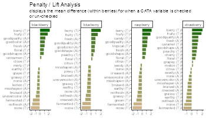
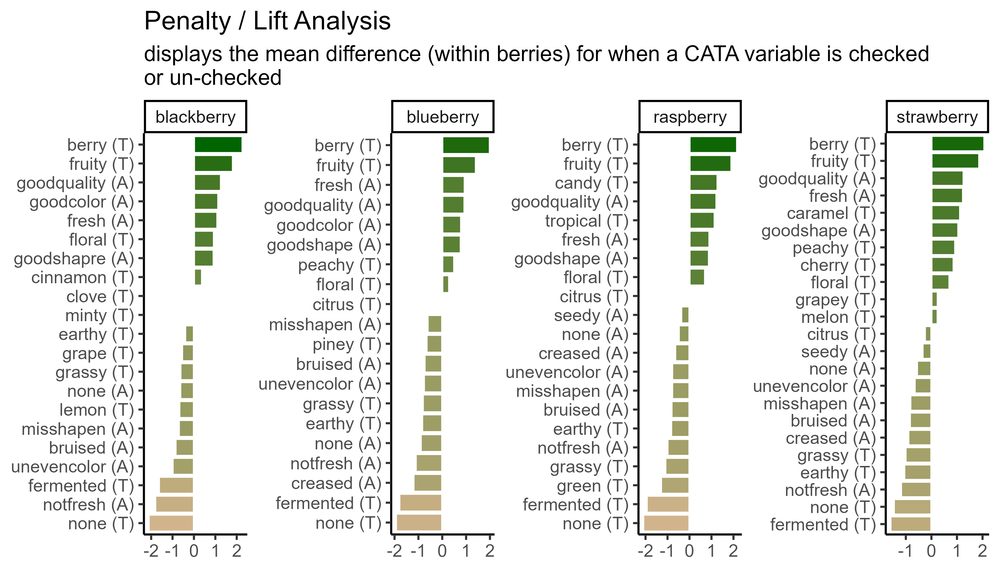

# Introduction and welcome {-}


Welcome to the Sensometrics Workshop "**Publication-quality data visualizations using the R tidyverse**"!

This workshop is going to be conducted not using slides, but through **livecoding**.  That means we are going to run code lines in the console or highlight and run code in scripts and other files.  It is also an opportunity and encouragement for you to follow along.  Along with introducing ourselves for today's workshop, we're going to discuss a bit about how that will work here.

## Introductions {-}

### Kyle Hamilton, PhD {-}
Kyle Hamilton is the Lead Sensory Data Analyst and Trainer at Flavor Linguist, LLC, in the US. Kyle's primary research interest is flavor language, including the ways that people talk about flavors using their own words in different contexts. [Flavor Linguist](https://flavorlinguist.com) offers data analysis services for language and survey data, or training and support for those looking to do it themselves.

### Jacob Lahne, PhD {-}

Jacob Lahne is an Associate Professor of Food Science & Technology at Virginia Tech, in the United States.  He runs the Virginia Tech Sensory Evaluation Laboratory, as well as teaching courses in data analytics and coding for food-science research.  His main research focuses are sensory data-analysis methodologies and investigating the sensory properties of fermented and distilled foods and beverages.

### Elizabeth Clark, PhD {-}

Elizabeth Clark is a Senior Scientist in Sensory & Consumer Sciences at McCormick & Company Inc. — a global leader in flavor operating in two segments across 170 countries and territories. McCormick’s passion for Sensory & Consumer Science has led to published research on a replacement for the Scoville heat method for the sensory determination of pungency in capsicum products (Gillette, Appel, & Leggo, 1984); The Sensory Quality System (SQS): a global quality control solution (King et.al, 2022); the EsSense Profile®— a scientific measurement of the human emotional response to flavor (King & Meiselman, 2010), and The Wellsense Profile™ — a questionnaire to measure consumer wellness with foods (King et.al, 2015). Leveraging her interests in data analytics & coding, Elizabeth is helping McCormick usher in a new era of sensory research geared toward addressing rapidly evolving challenges faced by global food & beverage companies.

## Today's agenda {-}

Today's workshop is going to take ~3 hours, and we'll be covering the following material:

1.  Importing/Exporting/Organizing Data
    1. Reading tabular data
    2. Basic data cleaning
    3. Saving/exporting data
3.  Intro to `ggplot2`
4.  Other Packages & Extras
    1. Adding layers and geoms (e.g., `ggrepel`)
    2. Plot-builders (e.g., `factoextra`)
    3. Combining plots
5.  Fine-Tuning Publication-Quality ggplots
    1. Exporting plots
    2. Formatting text
    3. Ordering categorical variables
  
## How we're going to run {-}

This workshop is going to be run with **livecoding**, as noted above.  This means we won't be using slides or a prepared video, but running through code step by step to show how these tools are used in practice.  We encourage **you** to also follow along with livecoding, because the best way to learn coding is to actually do it.

### Recommended approach for livecoding {-}

We recommend that you download the pre-made archive of code and data from the [workshop github repo](https://github.com/jlahne/pangborn-tutorial-2025).  This archive, when unzipped, will have a folder structure and a `.Rproj` file.  We recommend that you close out RStudio, unzip the archive, and double click the `.Rproj` file *in that folder*, which will open a new session of RStudio with proper settings (like the home directory) for the files for this workshop.

In that folder, you will find a `data/` folder with the necessary data for the workshop, and a script named `sensometrics-all-code.R`.  This latter file contains all of the code demonstrated in this workshop for your future reference.  You can also follow along with the code at the [workshop's page hosted on github.io]() (which you're reading right now), and which will remain available after this workshop.

Once you're in RStudio, go to the `File > New File > R Script` menu to open a new script.  Scripts are basically workbooks for you to store sequential lines of code to be run in the `Console`.  It is where you can livecode along!  Even though we are giving you all of the code you need right now, you will learn a lot more if you actively write out the code to follow along, rather than just running the entire code file.

The `Console` is the place to run code that is short and easy to type, or that you're experimenting with.  It will allow you to write a single line of code, and after you hit `return`, `R` will execute the command.  This is great for "interactive programming", but it isn't so great for building up a complex workflow, or for following along with this workshop!

You can write multiple lines of code in your `R` Script, then execute each one in any order (although keeping a logical sequence from top to bottom will help you keep track of what you're doing).  In an `R` script, everything is expected to be valid R code.


``` r
You can't write this in an R script because it is plain text.  This will
cause an error.

# If you want to write text or notes to yourself, use the "#" symbol at the start of 
# every line to "comment" out that line.  You can also put "#" in the middle of
# a line in order to add a comment - everything after will be ignored.

1 + 1 # this is valid R syntax

print("hello world") # this is also valid R syntax
```

To run code from your `R` script, put your cursor on the line you want to run and either hit the run button with the green arrow at the top left or (my preferred method) type `cmd + return` (on Mac) or `ctrl + return` (on PC).

### Dealing with errors {-}

Coding means **making mistakes**.  This is fine--as you will surely see today, we will make a ton of trivial errors and have to fix things on the fly.  If you run into trouble, try looking carefully at what you've done and see if you can see what went wrong.  You can also make use of the help files in `R`.

You can always get help on a particular function by typing `?<search term>`, which will make the help documentation for whatever you've searched for appear. For example, try typing the following to get help for the `sessionInfo()` command:


``` r
?sessionInfo
```

But what if you don't know what to search for?

By typing `??<search term>` you will search **all** help files for the search term.  R will return a list of matching articles to you in the help pane.  This is considerably slower, since it's searching hundreds or thousands of text files.  Try typing `??install` into your console to see how this works.

You will notice that there are two types of results in the help list for install.  The help pages should be familiar.  But what are "vignettes"?  Try clicking on one to find out.

Vignettes are formatted, conversational walkthroughs that are increasingly common (and helpful!) in R packages.  Rather than explaining a single function they usually explain some aspect of a package, and how to use it.  And, even better for our purposes, they are written in R Markdown.  Click the "source" link next to the vignette name in order to see how the author wrote it in R Markdown.  This is a great way to learn new tricks.

While you can find vignettes as we just did, a better way is to use the function `browseVignettes()`.  This opens a web browser window that lists **all** vignettes installed on your computer.  You can then use `cmd`/`ctrl + F` to search using terms in the web browser and quickly find package names, function names, or topics you are looking for.

## PSA: not-knowing is normal! {-}

Above, I mentioned "help files". How do we get help when we (inevitably) run into problems in R? There are a couple steps you will find helpful in the future:

1.  Look up the help file for whatever you're doing. Do this by using the syntax `?<search item>` (for example `?c` gets help on the vector command) as a shortcut on the console.
2.  Search the help files for a term you think is related. Can't remember the command for making a sequence of integers? Go to the "Help" pane in RStudio and search in the search box for "sequence". See if some of the top results get you what you need.
3.  The internet. Seriously. I am not kidding even a little bit. R has one of the most active and (surprisingly) helpful user communities I've ever encountered. Try going to google and searching for "How do I make a sequence of numbers in R?" You will find quite a bit of useful help. I find the following sites particularly helpful
    1.  [Stack Overflow](https://stackoverflow.com/questions/tagged/r)
    2.  [Cross Validated/Stack Exchange](https://stats.stackexchange.com/questions/tagged/r)
    3.  Seriously, [Google will get you most of the way to helpful answers](https://is.gd/80V5zF) for many basic R questions.


We may come back to this, but I want to emphasize that **looking up help is normal**. I do it all the time. Learning to ask questions in helpful ways, how to quickly parse the information you find, and how to slightly alter the answers to suit your particular situation are key skills.

### Getting Help {-}
If you get stuck and can't figure out what went wrong, we are here to help!  Because we have 2 instructors for this workshop, one of us is available to help at any time.

When you run into trouble, please raise your hand.  We'll be keeping an eye out, and whichever instructor isn't livecoding will come to help you.  If your issue is a common one or something we think is worth noting, don't worry--we'll make time to discuss it!


<!--chapter:end:index.Rmd-->

---
output: html_document
---

# Importing and wrangling data


Now that everyone is on the same page for how we're going to use `R`, we're going to dive right into importing our data into `R`, exploring it, and--most importantly--visualizing it.  In this part of the tutorial, we are going to focus on getting data into `R` and manipulating it.  
Personally, I prefer to see the reason for doing something, rather than being shown a bunch of building blocks and not seeing how they fit together.  Therefore, we're going to start off this section with a complete work flow for importing and visualizing some real results, and then work backward as we unpack how and why we've taken particular steps.

## Motivation: exploring berry and cider CATA/liking data

Before we begin, we need to make sure we've loaded the packages we're going to use.  


``` r
# This package is actually a set of utility packages we will use a lot
library(tidyverse)
```

## Getting data into `R`

Before we're able to analyze anything, we need to get data into `R`.  In the workshop archive you downloaded, the `data/` directory has files called `clt-berry-data.csv` and `CiderDryness_SensoryDATA.csv`.  These are the files that hold the raw data.

### Where the data live

To get these data into `R`, we need to briefly talk about **working directories** because this is how `R` "sees" your computer.  It will look first in the working directory, and then you will have to tell it where the file is *relative* to that directory.  If you have been following along and opened up the `.Rproj` file in the downloaded archive, your working directory should be the archive's top level, which will mean that we only need to point `R` towards the `data/` folder and then the `clt-berry-data.csv` file.  We can check the working directory with the `getwd()` function.


``` r
getwd()
```

```
## [1] "/Users/jake/Library/CloudStorage/Dropbox/Work/Collaborations/2025/pangborn-tutorial-2025"
```

Therefore, **relative to the working directory**, the file path to this data is `data/clt-berry-data.csv`.  Please note that this is the UNIX convention for file paths: in Windows, the backslash `\` is used to separate directories.  Happily, RStudio will translate between the two conventions, so you can just follow along with the macOS/UNIX convention (`/`) in this workshop.


``` r
raw_berry_data <- read_csv(file = "data/clt-berry-data.csv")
raw_cider_data <- read_csv(file = "data/CiderDryness_SensoryDATA.csv")
```

As a note, in many countries the separator (delimiter) will be the semi-colon (`;`), since the comma is used as the decimal marker.  To read files formatted this way, you can use the `read_csv2()` function.  If you encounter tab-separated values files (`.tsv`) you can use the `read_tsv()` function.  If you have more non-standard delimiters, you can use the `read_delim()` function, which will allow you to specify your own delimiter characters.  Excel stores data by default in the `.xlsx` format, which can be read by installing and using the `readxl` package (or saving Excel data as `.csv`).  You can also read many other formats of tabular data using the `rio` package ("read input/output"), which can be installed from CRAN (using, as you have learned, `install.packages("rio")`).

The `read_csv()` function creates a type of object in `R` called a `tibble`, which is a special type of `data.frame`.  These are rectangular "spreadsheet-like" objects like you would encounter in Excel or manipulate in JMP or SPSS.

## The destination

The plan here is to present "full" workflows for data import, wrangling, and visualization below so as to give a skeleton to work through.  This is going to look like a lot of code at once, but I don't use anything in these workflows that we will not be covering (in some way!) today.  Hopefully, by the end of today's workshop you will be able both to understand and dissect complex code and use it to build your own analyses and visualizations.

### Cider {#cider}

These data come from a small consumer study on 3 commercial "hard" (alcoholic) ciders, served in two conditions (chilled or unchilled) to 48 consumers, who used a pre-defined CATA lexicon, rated overall liking, and evaluated cider "dryness" on a 4-pt, structured line scale.  The full details of the study are published in @calvert2022a.  Here, we develop a complex and informative Correspondence Analysis (CA) plot of these results, as this is a very common output for sensory scientists.


``` r
raw_cider_data <- 
  read_csv("data/CiderDryness_SensoryDATA.csv")

cider_samples <-
  raw_cider_data %>%
  select(Sample_Name, Temperature) %>%
  unite(Sample_Name, Temperature, col = "sample", sep = " ", remove = FALSE) %>%
  distinct()

ca_cider <- 
  raw_cider_data %>%
  select(Sample_Name, Temperature, Fresh_Apples:Synthetic) %>%
  unite(Sample_Name, Temperature, col = "sample", sep = " ") %>%
  group_by(sample) %>%
  summarize(across(where(is.numeric), ~sum(.))) %>%
  column_to_rownames("sample") %>%
  FactoMineR::CA(graph = FALSE)

ca_cider_coords <- 
  ca_cider$row$coord %>%
  as_tibble(rownames = "name") %>%
  mutate(type = "row") %>%
  bind_rows(
    ca_cider$col$coord %>%
      as_tibble(rownames = "name") %>%
      mutate(type = "col")
  ) %>%
  left_join(cider_samples, join_by(name == sample)) %>%
  mutate(name = if_else(is.na(Sample_Name), name, Sample_Name),
         name = str_replace_all(name, "_", " "),
         name = str_replace(name, "FullBodied", "Full Bodied"))

nice_cider_labels <-
  labs(x = str_c("Dimension 1, ", round(ca_cider$eig[1, 2], 1), "% of inertia"),
       y = str_c("Dimension 2, ", round(ca_cider$eig[2, 2], 1), "% of inertia"),
       subtitle = "Correspondence Analysis biplot (symmetric)",
       title = "Effect of cider serving temperature on consumer sensory perception")

p2_ca_cider_cata <- 
  ca_cider_coords %>%
  mutate(font = if_else(type == "row", "plain", "italic")) %>%
  ggplot(aes(x = `Dim 1`, y = `Dim 2`)) +
  geom_vline(xintercept = 0, linetype = "dashed", color = "darkgrey") +
  geom_hline(yintercept = 0, linetype = "dashed", color = "darkgrey") +
  geom_point(aes(color = type, shape = Temperature),
             data = ca_cider_coords %>% filter(type == "row"),
             size = 3) +
  ggrepel::geom_text_repel(aes(label = name, color = type, fontface = font),
                           show.legend = FALSE) +
  coord_equal() + 
  theme_linedraw() +
  theme(legend.position = "bottom") +
  nice_cider_labels + 
  scale_color_manual(values = c("darkorange", "darkgreen")) +
  scale_shape_manual(values = c(8, 16)) +
  guides(shape = guide_legend(),
         color = "none")

p2_ca_cider_cata
```


### Berries {#berries}

Here we are going to import and process data from a study on berries.  These data come from a large, central-location study on berries, the methodological details of which are published in @yeung2021.  Very briefly, the data describe the attributes and liking scores reported by consumers for a variety of berries across multiple CLTs. A total of 969 participants (`Subject Code`) and 23 berries (`Sample Name`) were involved in these tests, with only one species of berry (blackberry, blueberry, raspberry, or strawberry) presented during each CLT.  In the actual experimental design, subjects got multiple sample sets (so there are *not* 969 unique subjects), but here we will treat them as unique for ease of description.


``` r
# Import the data
raw_berry_data <- 
  read_csv(file = "data/clt-berry-data.csv") %>%
  select(where(~ !all(is.na(.)))) 

cleaned_berry_data <-
  raw_berry_data %>%
  # Get the relevant columns
  select(`Subject Code`, 
         berry,
         sample,
         starts_with("cata_"), 
         contains("overall")) %>%
  # Rescale the LAM and US scales to a 9-pt range
  mutate(lms_overall = (lms_overall + 100) * (8 / 200) + 1,
         us_overall = (us_overall + 0) * (8 / 15) + 1) %>%
  # Switch the 3 overall liking columns into a single column
  pivot_longer(contains("overall"),
               names_to = "hedonic_scale",
               values_to = "rating",
               values_drop_na = TRUE) %>%
  # Let's make all the CATA variables into a single column to make life easier
  # (and get rid of those NAs)
  pivot_longer(starts_with("cata_"),
               names_to = "cata_variable",
               values_to = "checked",
               names_transform = ~str_remove(., "cata_"),
               values_drop_na = TRUE)

berry_penalty_analysis_data <- 
  cleaned_berry_data %>%
  group_by(berry, cata_variable, checked) %>%
  summarize(penalty_lift = mean(rating),
            count = n()) %>%
  ungroup() 

# Make a plot of the overall penalty/lift for checked attributes
p1_berry_penalty <- 
  berry_penalty_analysis_data %>%
  select(-count) %>%
  pivot_wider(names_from = checked,
              values_from = penalty_lift,
              names_prefix = "checked_") %>%
  group_by(berry, cata_variable) %>%
  summarize(penalty_lift = checked_1 - checked_0) %>%
  # We can tidy up our CATA labels
  separate(cata_variable, 
           into = c("mode", "variable"), 
           sep = "_") %>%
  # Fix a typo
  mutate(mode = str_replace(mode, "appearane", "appearance")) %>%
  mutate(mode = case_when(mode == "taste" ~ "(T)",
                          mode == "appearance" ~ "(A)")) %>%
  unite(variable, mode, col = "cata_variable", sep = " ") %>%
  # We are using a function from tidytext that makes faceting the final figure
  # easier
  mutate(cata_variable = tidytext::reorder_within(x = cata_variable,
                                                  by = penalty_lift,
                                                  within = berry)) %>%
  #And finally we plot!
  ggplot(mapping = aes(x = cata_variable, y = penalty_lift)) +
  geom_col(aes(fill = penalty_lift), color = "white", show.legend = FALSE) + 
  facet_wrap(~berry, scales = "free", nrow = 1) + 
  tidytext::scale_x_reordered() + 
  coord_flip() + 
  theme_classic() + 
  scale_fill_gradient(low = "tan", high = "darkgreen") + 
  labs(x = NULL, y = NULL,
       title = "Penalty / Lift Analysis",
       subtitle = "displays the mean difference (within berries) for when a CATA variable is checked\nor un-checked")

p1_berry_penalty
```


### "Publication quality"

What do we mean by "publication quality" visualizations?  Neither of us are theorists of visualization--for that, we would recommend that you look at the excellent work from [Claus Wilke](https://clauswilke.com/dataviz/) and [Kieran Healey](https://socviz.co/index.html#preface).  We will not be discussing (in any detail) ideas about which color palettes best communicate different types of data, what kinds of displays are most effective (box plots vs violin plots vs ...), or whether pie charts are really so bad (mostly yes).  

Rather, we have noticed that most `R` packages for data analysis provide visualizations as part of their output, and many sensory scientists are using these *default* outputs in publications.  This is annoying because often these visualizations are meant to be part of the data exploration/analysis process: they are not polished or they don't display the data to its best advantage (whatever that is for the particular case).  In this workshop, we want to help you develop the competency to alter or re-make these visualizations for yourself so that you can produce visualizations that are relevant to *your* application, that are attractive and easy to read.

As an example, the `FactoMineR` package has excellent default visualizations for exploring and understanding the basic outputs of many common multivariate analyses used by sensory scientists. We can take a look at our cider CATA data visualized as a symmetric CA "biplot" without much effort:


``` r
p3_cider_factominer <- plot(ca_cider)
p3_cider_factominer
```


But there might be things about this we want to change!  It would be very helpful to know, for example, that this is a `ggplot2` object that can be altered by a basic handful of standardized syntax.  For example:


``` r
p3_cider_factominer +
  theme_dark() + 
  labs(caption = "Now we can say some more things!", 
       subtitle = "of 6 ciders tasted by 48 subjects")
```


Like I said, we're not here to tell you *how* your plots should look...

Furthermore, default plots often do not allow us to do everything we want to do.  Say we were very attached to the orange and green color scheme I used above, and wanted to use it in the nice plot from `FactoMineR`:


``` r
p3_cider_factominer + 
  scale_color_manual(values = c("darkorange", "darkgreen"))
```


Hmm.

The motivating point, here, is to be able to make visualizations that accomplish what you want them to, rather than being at the mercy of packages that have certain defaults built in.

## Saving your data

Often, you will have an ugly, raw data file.  You want to clean up this data file: remove junk variables, rename columns, omit outliers, and have something that is actually workable.  Sometimes, you create a new intermediate product (say, a penalty-analysis table) that you'd like to be able to share and work with elsewhere.  Now, you know how to do all that in `R`, often with fewer clicks and less effort than in Excel or other WYSIWYG tool.  But once you restart your `R` session, you will need to rerun this workflow, and you can't access your data products in other software.

To save this work, you can use `write.csv()` or `readr::write_csv()` and its relatives (e.g., functions like `write.file()`).  These will create **or overwrite** a file in the directory location you specify.


``` r
# We will keep in the tidyverse idiom with readr::write_csv()
write_csv(x = berry_penalty_analysis_data,
          file = "data/berry-penalty-data.csv")
```

Sometimes, we want to be able to save `R` data for re-loading later.  It's good to do this explicitly, rather than relying on something like RStudio's version of autosaving (which we've turned off for you at the beginning of this tutorial).  You might want to do this instead of `write_csv()` because:

-  You have non-tabular data (lists, tensors, ggplots, etc)
-  You are saving the output of time-consuming workflows and want to be able to start again without re-running those workflows
-  You want to bundle a lot of objects together into a single file for yourself or other `R` users

If you want to save a single `R` object, the `write_rds()` function saves an object into a native `R` data format: `.rds`.  This uses syntax similar to `write_csv()`:


``` r
berry_penalty_analysis_data %>%
  write_rds(file = "data/berry-penalty-data.rds")
```

Often, though, it can be helpful to save multiple `R` objects so that a workplace can be restored.  In this case, the generic `save()` function will save a *list* of `R` objects provided as symbolic names into a file of format `.RData`, which can be restored with `load()`.  


``` r
save(berry_penalty_analysis_data,
     ca_cider_coords,
     ca_cider,
     file = "data/workshop-data.RData")

rm(berry_penalty_analysis_data,
     ca_cider_coords,
     ca_cider)

load(file = "data/workshop-data.RData")
```

This can be very helpful for sharing data.

### A note on replicability

In order to make sure that your data are replicable, you should *always* keep your raw data and the script/code that transforms that data into your cleaned form.  That way, when (*not* if) you discover a couple minor errors, you can go back and fix them, and you will not be stuck trying to remember how you overwrote this data in the first place.

This will also protect you if, in the future, someone looks at your data and asks something like "but where did these means come from?"

## Wrap up

This introductory section speeds over a large number of basic data-manipulation tasks that are key to any kind of analysis.  To learn more, you can look into some of the resources we've linked here (in particular the [R for Data Science handbook](https://r4ds.hadley.nz/)), some of our [previous](https://jlahne.github.io/eurosense-tutorial-2022/) [workshops](https://lhami.github.io/pangborn-r-tutorial-2023/) on the topic, to see how these tools can be applied to sensory data, or my recently created [R Opus v2](https://jlahne.github.io/r-opus-v2/), which applies these tools to a variety of common sensory analyses.

<!--chapter:end:01-import-motivation-export.Rmd-->

---
output: html_document
---
  
# The basics of plotting with `ggplot2`
  


Base `R` includes extremely powerful utilities for data visualization, but most modern applications make use of the `tidyverse` package `ggplot2`.

A quick word about base `R` plotting--I don't mean to declare that you can't use base `R` plotting for your projects at all, and I have published several papers using base `R` plots.  Particularly as you are using `R` for your own data exploration (not meant for sharing outside your team, say), base utilities like `plot()` will be very useful for quick insight. 

`ggplot2` provides a standardized, programmatic interface for data visualization, in contrast to the piecemeal approach common to base `R` graphics plotting.  This means that, while the syntax itself can be challenging to learn, syntax for different tasks is linked by a common vocabulary, and differs in logical and predictable ways.

Together with other `tidyverse` principles (like `select()` and `filter()` approaches), `ggplot2` makes it easy to make publication-quality visualizations with relative ease.

In general, `ggplot2` works best with data in "long" or "tidy" format, such as that resulting from the output of `pivot_longer()`.  The 

The schematic elements of a ggplot are as follows:


``` r
# The ggplot() function creates your plotting environment.  We usually save it to a variable in R so that we can use the plug-n-play functionality of ggplot without retyping a bunch of nonsense
p <- ggplot(mapping = aes(x = <a variable>, y = <another variable>, ...),
            data = <your data>)

# Then, you can add various ways of plotting data to make different visualizations.
p + 
  geom_<your chosen way of plotting>(...) +
  theme_<your chosen theme> +
  ...
```

In graphical form, the following diagram ([from VT Professor JP Gannon](https://vt-hydroinformatics.github.io/Plotting.html#our-first-ggplot)) gives an intuition of what is happening:


## Your first `ggplot()`

Our cider data is already relatively tidy and is much easier to visually inspect, so we will be primarily using it in this section.  

Let's begin by making an example `ggplot()` to demonstrate how it works.  We will focus on the cider CA coordinates so that we can build up a somewhat meaningful plot.


``` r
# We start with our data and pipe it into ggplot
ca_cider_coords %>%
  # Here we set up the base plot
  ggplot(mapping = aes(x = `Dim 1`, y = `Dim 2`)) + 
   # Here we tell our base plot to add points
  geom_point()                          
```


This doesn't look all that impressive--partly because the data being plotted itself isn't sensible without other context that exists in the data frame, and partly because we haven't made many changes.  But before we start looking into that, let's break down the parts of this command.

## The `aes()` function and `mapping = ` argument

The `ggplot()` function takes two arguments that are essential, as well as some others you'll rarely use.  The first, `data = `, is straightforward, and you'll usually be passing data to the function at the end of some pipeline using `%>%`

The second, `mapping = `, is less clear.  This argument requires the `aes()` function, which can be read as the "aesthetic" function.  The way that this function works is quite complex, and really not worth digging into here, but I understand it in my head as **telling `ggplot()` what part of my data is going to connect to what part of the plot**.  So, if we write `aes(x = `Dim 1`)`, we can read this in our heads as "the values of x will be mapped from the 'Dim 1' column". 

> NB: The use of the `\`` character in `\`Dim 1\`` is because the name is technically "non-syntactic": it has a space in it.  `R` allows us to save objects with names that violate the rules--containing whitespace (` `), starting with a number character, or including characters like `(`, `)`, `$`, etc by using the `\`` operators.  The `{tidyverse}` functions do this automatically.

This sentence tells us the other important thing about `ggplot()` and the `aes()` mappings: **mapped variables each have to be in their own column**.  This is another reason that `ggplot()` requires tidy data. 

## Adding layers with `geom_*()` functions

In the above example, we added (literally, using `+`) a function called `geom_point()` to the base `ggplot()` call.  This is functionally a "layer" of our plot, that tells `ggplot2` how to actually visualize the elements specified in the `aes()` function--in the case of `geom_point()`, we create a point for each row's combination of `x = MerlynScale_Ranking` and `y = Liking`.


``` r
ca_cider_coords %>% 
  select(`Dim 1`, `Dim 2`)
```

```
## # A tibble: 28 × 2
##    `Dim 1` `Dim 2`
##      <dbl>   <dbl>
##  1 -0.309   0.0232
##  2 -0.331   0.0449
##  3  0.0151 -0.165 
##  4  0.192  -0.193 
##  5  0.225   0.137 
##  6  0.201   0.147 
##  7 -0.303   0.0826
##  8  0.0514 -0.111 
##  9  0.280   0.0580
## 10  0.0907 -0.0946
## # ℹ 18 more rows
```

There are many `geom_*()` functions in `ggplot2`, and many others defined in other accessory packages.  These are the heart of visualizations.  We can swap them out to get different results:


``` r
ca_cider_coords %>%
  ggplot(mapping = aes(x = `Dim 1`, y = `Dim 2`)) + 
  # connecting our points with a line makes even less sense
  geom_line()
```


The default `geom_line()` behavior is to connect points ordered by the column that is assigned to `x = ` in the `aes()` function.

We can also combine layers, as the term "layer" implies:


``` r
ca_cider_coords %>%
  ggplot(mapping = aes(x = `Dim 1`, y = `Dim 2`)) + 
  geom_point() +
  # add a layer with the names of the points
  geom_text(mapping = aes(label = name))
```


Note that we don't need to tell *either* `geom_point()` or `geom_text()` what `x` and `y` are--they "inherit" them from the `ggplot()` function to which they are added (`+`), which defines the plot itself.  But we did need to give a *new* mapping--`label = name`--to the `geom_text()` layer, which tells it which column to get the labels for each point.

What other arguments can be set to aesthetics?  Well, we can set other visual properties like **color**, **size**, **transparency** (called "alpha"), and so on.  Let's go ahead and color the different points and labels by whether they are ciders or CATA descriptors--whether they are rows or columns in the original contingency table.


``` r
ca_cider_coords %>%
  ggplot(mapping = aes(x = `Dim 1`, y = `Dim 2`, color = type)) + 
  geom_point() +
  geom_text(mapping = aes(label = name))
```


Notice again that we don't have to specify our color inside each label--because we define this "aesthetic" at the level of the plot in the `ggplot()` function all layers that can use it will "inherit" it.

If we want to only color a single layer, we have a couple options.  The simplest is simply to define the mapping only at the layer level, not the plot level.


``` r
ca_cider_coords %>%
  ggplot(mapping = aes(x = `Dim 1`, y = `Dim 2`)) + 
  # we will only color the points, not the text
  geom_point(mapping = aes(color = type)) +
  geom_text(mapping = aes(label = name))
```


## Arguments inside and outside of `aes()`

In the above plots, we are obviously unhappy with the position of the text in regards to the points: we are overplotting!  What if we wanted to move our text so that it's not centered on the $(x,y)$ point?  (We will see a better way to do this automatically later.)


``` r
ca_cider_coords %>%
  ggplot(mapping = aes(x = `Dim 1`, y = `Dim 2`)) + 
  geom_point(mapping = aes(color = type)) +
  geom_text(mapping = aes(label = name),
            hjust = "outward",
            color = "darkblue")
```


Here we set two aesthetics that *could* be in the `aes()` function and tied to data, but that we want to only set to a single value: we want all of our text to be `"darkblue"` (sure, why not?) and we use the `hjust = "outward"` text alignment option to push our text away from the center of the plot and thus not to overplot our points.  

Here I will also note that manual text adjustment is usually not the best approach with text-heavy scatterplots such as are common in sensory science biplots.  We will usually prefer to use an automatic approach for adjusting text position from the `{ggrepel}` package.  We can either load `{ggrepel}` directly using `library(ggrepel)` or we can use the `::` syntax to access an installed function without loading the entire namespace.


``` r
ca_cider_coords %>%
  ggplot(mapping = aes(x = `Dim 1`, y = `Dim 2`)) + 
  geom_point(mapping = aes(color = type)) +
  # here we opt for not loading the package
  ggrepel::geom_text_repel(mapping = aes(label = name),
            color = "darkblue") +
  scale_color_manual(values = c("darkorange", "darkgreen"))
```


### Using `theme_*()` to change visual options quickly

In the last several plots, notice that we are using the default (and to my mind unattractive) grey background of `ggplot2`.  If this tutorial had a single goal, it would be to eliminate this theme from published papers.  It looks *bad* (and tends to reduce contrast).


``` r
ca_cider_coords %>%
  ggplot(mapping = aes(x = `Dim 1`, y = `Dim 2`)) + 
  geom_point(mapping = aes(color = type)) +
  ggrepel::geom_text_repel(mapping = aes(label = name),
            color = "darkblue") +
  # here we switch to a black and white theme
  theme_bw()
```


We can easily get rid of the grey by adding a `theme_bw()` call to the list of commands.  `ggplot2` includes a number of default `theme_*()` functions, and you can get many more through other `R` packages.  They can have subtle to dramatic effects:


``` r
ca_cider_coords %>%
  ggplot(mapping = aes(x = `Dim 1`, y = `Dim 2`)) + 
  geom_point(mapping = aes(color = type)) +
  ggrepel::geom_text_repel(mapping = aes(label = name),
            color = "darkblue") + 
  theme_void()
```


The `theme_*()` functions are complete sets of plot background options.  You can edit every last element of the plot's theme using the base `theme()` function, which is powerful but a little bit tricky to use.


``` r
ca_cider_coords %>%
  ggplot(mapping = aes(x = `Dim 1`, y = `Dim 2`)) + 
  geom_point(mapping = aes(color = type)) +
  ggrepel::geom_text_repel(mapping = aes(label = name),
            color = "darkblue") + 
  theme_bw() + 
  # we use theme() to remove grid lines and move the legend, for example
  theme(panel.grid = element_blank(),
        legend.position = "bottom")
```


Many calls to `theme()` involve `element_*()` functions.  When we remove elements, for example, we use `element_blank()` (not, for example, `NA` or `NULL` as we typically would in other parts of `R`).

When we want to change how our text is formatted (not the values, but the formatting), we use `element_text()` calls.


``` r
ca_cider_coords %>%
  ggplot(mapping = aes(x = `Dim 1`, y = `Dim 2`)) + 
  geom_point(mapping = aes(color = type)) +
  ggrepel::geom_text_repel(mapping = aes(label = name),
            color = "darkblue") +
  theme_bw() + 
  # let's make the axis titles bold and the labels serif-font
  theme(axis.title = element_text(face = "bold"),
        axis.text = element_text(family = "serif"))
```


Finally, we can set default themes for a particular script using the `theme_set()` function.  We can also use this to set custom defaults:


``` r
theme_set(
  theme_bw() + 
    theme(panel.grid.minor = element_blank())
)

ca_cider_coords %>%
  ggplot(mapping = aes(x = `Dim 1`, y = `Dim 2`)) + 
  geom_point(mapping = aes(color = type)) +
  ggrepel::geom_text_repel(mapping = aes(label = name),
            color = "darkblue")
```


All plots from here on in the script will *default* to the `theme_bw()` theme, with the "minor" grid lines removed for a cleaner grid look.

### Changing aesthetic elements with `scale_*()` functions

Finally, say we didn't like the default color set for the points.  

How can we manipulate the colors that are plotted?  The **way in which** mapped, aesthetic variables are assigned to visual elements is controlled by the `scale_*()` functions.  

In my experience, the most frequently encountered scales are those for color: either `scale_fill_*()` for solid objects (like the bars in a histogram) or `scale_color_*()` for lines and points (like the outlines of the histogram bars, or the points and letters in our scatterplots so far).  

Scale functions work by telling `ggplot()` *how* to map aesthetic variables to visual elements.  You may have noticed that I added a `scale_color_manual()` function to the end of several plots above.  This function lets me manually specify the colors that are assigned to each colored element.


``` r
p <- 
  ca_cider_coords %>%
  ggplot(mapping = aes(x = `Dim 1`, y = `Dim 2`, color = type)) + 
  geom_point() +
  ggrepel::geom_text_repel(mapping = aes(label = name), 
                           # this command stops this layer from being added to
                           # the legend, to make it look cleaner
                           show.legend = FALSE)

p
```


We can take a saved plot (like `p`) and use scales to change how it is visualized.


``` r
p + scale_color_viridis_d()
```


`ggplot2` has a broad range of built-in options for scales, but there are many others available in add-on packages that build on top of it.  The `scale_*_viridis_*()` functions use a package callled `viridis` that provides (theoretically) color-blind safe colors for both continuous (gradient) and categorical (discrete) mappings, but I do find that their defaults (using light colors like yellow on one end of the scale) are hard to see for anyone!

As we saw above, you can also build your own scales using the `scale_*_manual()` functions, in which you give a vector of the same length as your mapped aesthetic variable in order to set up the visual assignment.  That sounds jargon-y, so here is an example:


``` r
# We'll pick 14 random colors from the colors R knows about

p + 
  scale_color_manual(values = c("wheat", "darkviolet"))
```


### Finally, `facet_*()`

So far we've seen how to visualize the overall configuration of our ciders by their CATA attributes using a Correspondence Analysis.  These results are, of course, based on an underlying contingency table:


``` r
cider_contingency
```

```
##                   Fresh_Apples Fermented Herbal Dry Spice Fruity Smooth Alcohol
## 1911 Est. Chilled           29        12      4  16    10     24     15      19
## 1911 Est. RT                27        17      7  15     5     25     18      13
## Buskey Chilled              19        22      8  22     9     15     15      19
## Buskey RT                   11        18     10  21    12     14     14      21
## Eden Chilled                16        14     13  20     9     13      9      17
## Eden RT                     17        18     10  17     7     16      7      21
##                   Light Sweet Woody Berries Sour Funky FullBodied Metallic
## 1911 Est. Chilled    19    16     2       4   20     1          4        5
## 1911 Est. RT         17    25     6       8   23     2          8        4
## Buskey Chilled       20    19     5       4   14    10          5        4
## Buskey RT            16    18     7       2   14    10          8        2
## Eden Chilled         11    14     8       2   24    12          5        9
## Eden RT              13    15    12       4   23    12          5        7
##                   Floral Candy Bitter Vomit Earthy Synthetic
## 1911 Est. Chilled      8     6     10     2      3         3
## 1911 Est. RT          10     6      7     1      2         3
## Buskey Chilled        13     1     12     1      5         3
## Buskey RT              9     0     13     5      9         4
## Eden Chilled          11     3     13     5      9         7
## Eden RT               11     1     13     3      6        10
```

A natural visualization to quickly assess CATA results is of course a bar plot.


``` r
cider_contingency %>% 
  as_tibble(rownames = "sample") %>%
  pivot_longer(-sample) %>%
  ggplot(mapping = aes(x = name, y = value, fill = sample)) + 
  geom_col(position = "dodge") + 
  labs(x = NULL, y = NULL) + 
  # coord_*() functions affect how the axes are plotted;
  # coord_flip() switches the x- and y-axes
  coord_flip()
```


This is obviously not ideal for visualization: 

1. It is hard to see the bars.
2. CA plots are driven by ratios, so it would be good to see differences based on rates of endorsement for CATA per-attribute, not overall (common attributes swamp uncommon attributes).

The last powerful tool I want to show off is the ability of `ggplot2` to make what [Edward Tufte called "small multiples"](https://socviz.co/groupfacettx.html#facet-to-make-small-multiples): breaking out the data into multiple, identical plots by some categorical classifier in order to show trends more effectively.


``` r
cider_contingency %>% 
  as_tibble(rownames = "sample") %>%
  pivot_longer(-sample) %>%
  ggplot(aes(x = sample, y = value)) + 
  geom_col(aes(fill = sample)) +
  scale_fill_manual(values = wesanderson::wes_palettes$AsteroidCity2) + 
  coord_flip() + 
  facet_wrap(~name, ncol = 6) + 
  labs(x = NULL, y = NULL, fill = NULL) + 
  theme(legend.position = "top")
```


We can see that overall for the most frequently used attributes, the serving temperature doesn't matter (and for the most part there is some reassuring consistency in the use of terms to describe each cider at different temperatures).

But in the previous part of this workshop, we showed much more complex plots for our berry data, which showed the same plot broken up by a classifying variable: this is called "faceting".  Let's return from our cider data to our berry data in order to finally complete the workflow I showed in the beginning of the workshop.

Now we are prepared to walk through the entire workflow:


``` r
# First we wrangle our data using the tools we've learned to get penalties/lifts
# for each attributes
berry_penalty_analysis_data <- 
  berry_long_cata %>%
  group_by(berry, cata_variable, checked) %>%
  summarize(penalty_lift = mean(rating),
            count = n()) %>%
  ungroup() 

p1_berry_penalty <- 
  
  # We start by widening our data just a bit, and use a function to give some
  # better names to our mean values for when an attribute it checked (1) or not
  # (0).
  
  berry_penalty_analysis_data %>%
  select(-count) %>%
  pivot_wider(names_from = checked,
              values_from = penalty_lift,
              names_prefix = "checked_") %>%
  
  # Then we actually calculate the penalty/lift: what is the difference in the
  # mean liking when an attribute is checked or not?
  
  group_by(berry, cata_variable) %>%
  summarize(penalty_lift = checked_1 - checked_0) %>%
  
  # We have two kinds of CATA attibutes: visual assessment and by-mouth
  # assessment.  It would be nice to keep track.
  
  separate(cata_variable, 
           into = c("mode", "variable"), 
           sep = "_") %>%
  
  # Fix a typo
  
  mutate(mode = str_replace(mode, "appearane", "appearance")) %>%
  mutate(mode = case_when(mode == "taste" ~ "(T)",
                          mode == "appearance" ~ "(A)")) %>%
  unite(variable, mode, col = "cata_variable", sep = " ") %>%
  
  # We are using a function from tidytext that makes faceting the final figure
  # easier: reorder_within() makes a set of factors able to be ordered
  # differently within another variable.  In this case, we have different
  # attributes and different penalties within each berry by design
  
  mutate(cata_variable = tidytext::reorder_within(x = cata_variable,
                                                  by = penalty_lift,
                                                  within = berry)) %>%
  
  #And finally we plot!
  
  ggplot(mapping = aes(x = cata_variable, y = penalty_lift)) +
  geom_col(aes(fill = penalty_lift), color = "white", show.legend = FALSE) + 
  facet_wrap(~berry, scales = "free", nrow = 1) + 
  
  # To take advantage of our newly reordered factors, we also need to use the
  # matching tidytext::scale_x_reordered() function
  
  tidytext::scale_x_reordered() + 
  coord_flip() + 
  theme_classic() + 
  scale_fill_gradient(low = "tan", high = "darkgreen") + 
  labs(x = NULL, y = NULL,
       title = "Penalty / Lift Analysis",
       subtitle = "displays the mean difference (within berries) for when a CATA variable is checked\nor un-checked")

# Let's save it so we can come back to it later:
save(p1_berry_penalty, file = "data/goal-plot.RData")

p1_berry_penalty
```


We can see that the 2 most important attributes for driving liking are the same across all 4 berries, but that the highest penalty is different across them.

## Some further reading

This has been a lightning tour of `ggplot2` as preparatory material; it barely scratches the surface.  We're going to dig into some further tools that you can use for common sensory visualizations, but we've learned all of these tricks from the following resources (as well as a lot of work on Stack Overflow/Exchange):

1.  Kieran Healy's "[Data Visualization: a Practical Introduction](https://socviz.co/index.html#preface)".
2.  The plotting section of [R for Data Science](https://r4ds.had.co.nz/data-visualisation.html).
3.  Hadley Wickham's core reference textbook on [ggplot2](https://ggplot2-book.org/).


<!--chapter:end:02-ggplot2-basics.Rmd-->

---
output: html_document
---

# Fine-Tuning Publication-Quality ggplots


The plots we've been making so far are fairly straightforward demonstrations. At the very end of Chapter 3, we briefly showed you the code and results for this plot:


``` r
p1_berry_penalty
```


Which uses some tricks from the `stringr` and `tidytext` packages in order to give us easy-to-read labels. Using the existing column names and variable-codes in our original data to make a first draft of a plot, it would've looked more like this:


``` r
berry_penalty_analysis_data %>%
  select(-count) %>%
  pivot_wider(names_from = checked,
              values_from = penalty_lift,
              names_prefix = "checked_") %>%
  mutate(penalty_lift = checked_1 - checked_0) %>%
  ggplot(mapping = aes(x = cata_variable, y = penalty_lift)) +
  geom_col(aes(fill = penalty_lift), color = "white", show.legend = FALSE) + 
  facet_wrap(~berry, scales = "free", nrow = 2) +
  coord_flip() + 
  theme_classic() + 
  scale_fill_gradient(low = "tan", high = "darkgreen")
```


Which we're showing because we have seen similar plots published in journal articles, with the overlapping text, redundant axis labels, and all. We can make this more readable by reordering the CATA attributes, shortening and reformatting the labels, and possibly by removing some extraneous elements like the `cata_variable` label on the Y axis. These are common steps that make a huge difference.

And we'll get there, but first...

## Exporting and Saving Plots

It may seem like a weird time to be talking about saving plots, when we haven't gotten to the "fine-tuning" yet, but you should already be familiar with a few examples of things that change when the aspect ratio of the plot or the monitor you're viewing it on changes slightly. It is basically impossible to export a `ggplot` at the resolution needed for publishing without changing the aspect ratio, relative sizes, or space between some elements from what you're looking at in the Plots pane or the `.Rmd` chunk output.

It's good practice to export your plot as an image (or pdf or knit-together document or however else you plan to export it) and re-export it periodically as you go through fine-tuning.

This is also, probably, the most important part of this chapter. You will have to get every plot that you publish out of `R` somehow, after all! After that, we'll cover some tricks that we draw upon frequently, but you may find that you have different problems or priorities, or that some of these needs are situational.

But you will have to export plots for every project you want to share with the world.

### What format?

You can, as we've already discussed, save a `ggplot` object in a `.rds` file. But that won't let you put it into your powerpoint, or manuscript, or take it to the printer. You need an image file. The exact *type* of image will depend on the other software you're using for your report, presentation, paper, book, etc.

There are two major ways to save the kind of spatial color data that comprise images such as graphs. You can store them as **vector graphics**, which can be rescaled because they're made up of lines and shapes (most commonly, `.pdf` and `.svg`) or as **raster (bitmap) graphics**, which store images as a grid of **pixels** which each have a single uniform color (most commonly, `.png` and `.jpeg`).

-  `.pdf` vector images are best for **LaTeX** and professional publishing
-  `.svg` vector images are more widely supported in word processors and websites
-  `.png` raster images are the most predictable to print, the best for web publishing, and can be used in pretty much every software ever made, *if* you know exactly the size you want. 
-  `.jpeg` (along with `.tiff`) raster images are the raster format preferred by *Food Quality and Preference* editors. They are worse for web publishing than `.png` but share its other advantages.

Note that `ggsave()` is like making a `.pdf` version of your working documents: you will not be able to read the plot images into `R` for editing anymore, no matter which format you save in.

### Exporting Images with `ggsave()` {#ggsave}
The easiest way to reproducibly save plots, so that all of your export options are in your code and you might be able to recreate it on a different computer, is with the function `ggplot2::ggsave()`, which works *similarly* to the `write_*()` functions and `save()`. You give it a file name to save to, relative to the current working directory, and then the variable where your plot is saved.


``` r
ggsave("img/penalty-lift-png.png", p1_berry_penalty)
```

`ggsave()` supports all of the above-named image formats, as well as `.eps`, `.ps`, `.tex` (pictex), and `.bmp`. It will figure out from the file extension (the stuff after the `.` in the `filename` argument) what image type it's saving as, but you can also specify it explicitly with the `device` argument.

If you're reading this right now, you're looking at a webpage created using `bookdown` and `knitr`. We can't actually directly embed `.pdf` images in this site, but let's look at a few other example formats using the same plots.


``` r
ggsave("img/penalty-lift-svg.svg", p1_berry_penalty)
ggsave("img/penalty-lift-jpeg.jpeg", p1_berry_penalty)
```

Now let's compare how each of these looks! First, inside R:


``` r
p1_berry_penalty # If you're following along, this will look different in your R session!
```


The `.svg` image made by `ggsave()`:


The `.png` image made by `ggsave()`:


The `.jpeg` image made by `ggsave()`:


The two raster formats look basically the same, and only slightly different from the `.svg` and the version in the `.html` version of this tutorial. If you're following along in your own `R` session, however, you'll notice that these saved plots all look more similar to each other than they do to the initial plot you're previewing inside `R`. *All* of the plots have a bit more space around the text using `ggsave()`, taller bars, and a different aspect ratio ($width/height$).

We can adjust these using the rest of the arguments to `ggsave()`. The `width`, `height`, and `units` primarily control the image size (for raster images) and aspect ratio (for all images), but they also affect the relative size of plot elements. Larger plots will have axis labels, text, and `geom_*()`s that take up less of the overall plotting area, and vice-versa for smaller images.

If you get to this stage with a **vector image** and realize that all of the fixed-size elements (e.g., text) are too big or too small, you can use `ggsave()`'s `scale` argument. `scale` < 1 makes all the fixed-size elements *smaller* relative to the plot size and `scale` > 1 makes all the elements *bigger* relative to the plot size. `scale` < 1 will generally also give you a *larger plot area* and *more space between your geoms*.


``` r
ggsave("img/penalty-lift-svg-7x4.svg", p1_berry_penalty,
       width = 7, height = 4, units = "in")

ggsave("img/penalty-lift-svg-14x8.svg", p1_berry_penalty,
       width = 14, height = 8, units = "in")

ggsave("img/penalty-lift-svg-14x8-rescale.svg", p1_berry_penalty,
       width = 14, height = 8, units = "in", scale = .5)
```

The 7x4" vector plot:


The same plot saved at 14x8":


A 14.8" plot with `scale = 0.5`:


All of these `.svg` images are *displayed* at 7x4" on your screen, but the plot we made with `width = 14, height = 8` has smaller text and larger plotting areas unless we correct this with `scale`. `penalty-lift-svg-7x4.svg` and `penalty-lift-svg-14x8-rescale.svg` are actually identical files.

You should *avoid using `scale` for rasters*, as it will create plots that will not print at the size (`width` and `height`) and resolution (`dpi`) you specified. If you find yourself wanting to change the `scale` of a raster image, you should refer to the reference we've put together on `dpi` in the [Appendix](#ggresolution).

### Other Image Export Options

This is not a `knitr` or `bookdown` tutorial, because we had to choose our topics, but we used the `bookdown` package to make the [online webpage version of this tutorial](https://lhami.github.io/sensometrics-r-tutorial-2024/). It comes with its own advantages and challenges, but it does significantly streamline the image-generation process for any project where the only file you need is one LaTeX file, `.html` page, or `.pdf` output with all of the text and all of the figures. If that sounds appealing to you, turn your attention to ["bookdown: Authoring Books and Technical Documents with `R` Markdown" by Yihui Xie](https://bookdown.org/yihui/bookdown/).

## Making Text Look Okay

A good `R` variable or column name doesn't have any spaces or punctuation other than underscores (`_`) and dots (`.`), to avoid all those pesky backticks (`\``) in our code.

This is very different from what a good label in a plot looks like. You'll often want to make some sort of mass changes to column names or text variables before plotting, in order to address this.

### Powerful Text Manipulation with `stringr`

The `stringr` package is a part of the `tidyverse`, so you have it already loaded whenever you run `library(tidyverse)`. It has a lot of useful functions for working with text (called "**str**ings" in many programming languages), mostly of the form `str_*()`. One thing you can do is change labels to uppercase, lowercase, "sentence case", or "title case" (first letter of each word capitalized), as appropriate:


``` r
berry_penalty_analysis_data %>%
  select(berry) %>%
  mutate(Upper = str_to_upper(berry),
         Title = str_to_title(berry)) # Capitalizes the first letter of each word
```

```
## # A tibble: 170 × 3
##    berry      Upper      Title     
##    <chr>      <chr>      <chr>     
##  1 blackberry BLACKBERRY Blackberry
##  2 blackberry BLACKBERRY Blackberry
##  3 blackberry BLACKBERRY Blackberry
##  4 blackberry BLACKBERRY Blackberry
##  5 blackberry BLACKBERRY Blackberry
##  6 blackberry BLACKBERRY Blackberry
##  7 blackberry BLACKBERRY Blackberry
##  8 blackberry BLACKBERRY Blackberry
##  9 blackberry BLACKBERRY Blackberry
## 10 blackberry BLACKBERRY Blackberry
## # ℹ 160 more rows
```

`str_replace()` and `str_replace_all()` are very useful for dealing with underscores or periods. You give it `string`, the text vector you want to modify (inside `mutate()`, a column name); then `pattern`, the character(s) you want to replace; then `replacement`, what you want to replace them with.


``` r
berry_penalty_analysis_data %>%
  select(-count) %>%
  pivot_wider(names_from = checked,
              values_from = penalty_lift,
              names_prefix = "checked_") %>%
  mutate(cata_variable = str_replace_all(cata_variable, "_", ": "))
```

```
## # A tibble: 85 × 4
##    berry      cata_variable           checked_0 checked_1
##    <chr>      <chr>                       <dbl>     <dbl>
##  1 blackberry appearance: fresh            4.70      5.80
##  2 blackberry appearance: goodcolor        4.63      5.77
##  3 blackberry appearance: goodquality      4.69      5.96
##  4 blackberry appearance: goodshapre       4.93      5.86
##  5 blackberry appearance: misshapen        5.63      4.92
##  6 blackberry appearance: none             5.42      4.78
##  7 blackberry appearance: notfresh         5.57      3.76
##  8 blackberry appearance: unevencolor      5.53      4.53
##  9 blackberry appearane: bruised           5.53      4.67
## 10 blackberry taste: berry                 4.21      6.49
## # ℹ 75 more rows
```

They can both be as long as you like. If `pattern = _` and there's more than one `_` in one of the `string`s, `str_replace()` will only replace the first one and `str_replace_all()` will replace them all.


``` r
str_replace("long_text_with_many_underscores", "_", " ")
```

```
## [1] "long text_with_many_underscores"
```

``` r
str_replace_all("long_text_with_many_underscores", "_", " ")
```

```
## [1] "long text with many underscores"
```

You can add multiple sets of `pattern`s and `replace`ments to `str_replace_all()` using a named list: `c("pattern1" = "replace1", "pattern2" = "replace2"`. This is useful to, for instance, fix multiple typos like "goodshapre". Unlike the `case_when()` example we showed before, you can fix typos that occur anywhere in the text, even if they're only parts of a word.


``` r
berry_penalty_analysis_data %>%
  select(-count) %>%
  pivot_wider(names_from = checked,
              values_from = penalty_lift,
              names_prefix = "checked_") %>%
  mutate(cata_variable = str_replace_all(cata_variable,
                                         c("shapre" = "shape",
                                           "appearane" = "appearance",
                                           "_" = " ")))
```

```
## # A tibble: 85 × 4
##    berry      cata_variable          checked_0 checked_1
##    <chr>      <chr>                      <dbl>     <dbl>
##  1 blackberry appearance fresh            4.70      5.80
##  2 blackberry appearance goodcolor        4.63      5.77
##  3 blackberry appearance goodquality      4.69      5.96
##  4 blackberry appearance goodshape        4.93      5.86
##  5 blackberry appearance misshapen        5.63      4.92
##  6 blackberry appearance none             5.42      4.78
##  7 blackberry appearance notfresh         5.57      3.76
##  8 blackberry appearance unevencolor      5.53      4.53
##  9 blackberry appearance bruised          5.53      4.67
## 10 blackberry taste berry                 4.21      6.49
## # ℹ 75 more rows
```

Be careful using short `pattern`s, because they will replace every example *even if it's only part of a word*.


``` r
#This can lead to unintentional side-effects
c("nocolor", "none", "cornonthecob", "anode") %>%
  str_replace_all("no", " NO ")
```

```
## [1] " NO color"      " NO ne"         "cor NO nthecob" "a NO de"
```

``` r
#Or it can be useful for fixing lots of similar problems all at once
berry_penalty_analysis_data %>%
  select(-count) %>%
  pivot_wider(names_from = checked,
              values_from = penalty_lift,
              names_prefix = "checked_") %>%
  mutate(cata_variable = str_replace_all(cata_variable,
                                         c("not" = "not ",
                                           "good" = "good ",
                                           "uneven" = "uneven ",
                                           "_" = " ")))
```

```
## # A tibble: 85 × 4
##    berry      cata_variable           checked_0 checked_1
##    <chr>      <chr>                       <dbl>     <dbl>
##  1 blackberry appearance fresh             4.70      5.80
##  2 blackberry appearance good color        4.63      5.77
##  3 blackberry appearance good quality      4.69      5.96
##  4 blackberry appearance good shapre       4.93      5.86
##  5 blackberry appearance misshapen         5.63      4.92
##  6 blackberry appearance none              5.42      4.78
##  7 blackberry appearance not fresh         5.57      3.76
##  8 blackberry appearance uneven color      5.53      4.53
##  9 blackberry appearane bruised            5.53      4.67
## 10 blackberry taste berry                  4.21      6.49
## # ℹ 75 more rows
```

So far, we've been replacing letters and underscores, which is what we have in our example data. You can also use `str_replace()` for periods (`.`), although you may be surprised when you first try:


``` r
str_replace_all("long.text.with.many.periods", ".", " ") # Replaces everything
```

```
## [1] "                           "
```

``` r
str_replace_all("long.text.with.many.periods", "\\.", " ") # Replaces only dots
```

```
## [1] "long text with many periods"
```

We have to **escape** the period (with an escaped backslash, technically, but for now just know that you must put two backslashes `\\` before special characters when using `stringr`). Because the `str_*` functions with a `pattern` can use **Regular Expressions** (or regex), the characters (`\`, `.`, `[`, `]`, `{`, `}`, `(`, `)`, `<`, `>`, `*`, `+`, `-`, `=`, `!`, `?`, `^`, `$`, and `|`) need to be **escaped** with two backslashes if you need to replace them.

Regex are extremely powerful tools for finding patterns in text, similar to the intuitive ways a human might recognize something like an email address, a measurement, or a parenthetical. We will not be talking about regex today, but if you want to see some examples and resources for learning how to use them, we've provided a short overview and links to some resources in the [Appendix](#regex).

## Removing Legends and Plot Elements

You've already seen us use `+ theme(panel.grid = element_blank())` to get rid of the grid lines in a plot. You can use `element_blank()` to get rid of lots of plot elements you might not want for whatever reason, usually because it's redundant with information you have elsewhere and thus just making the plot look more complicated or harder to read at a glance. The most common things you might want to remove are:

- `plot.title`, if some function added a title to the top of your plot and you want to get rid of it.
- `axis.title`, `axis.title.x`, or `axis.title.y` if you don't need the column name(s) labeling your axes
- `axis.ticks`, `axis.ticks.x`, or `axis.ticks.y` if you want to remove the little tick marks along a given axis (useful for bar plots)


``` r
berry_long_liking %>%
  ggplot(aes(x = Scale, y = Liking, color = Scale)) +
  ggbeeswarm::geom_quasirandom() +
  facet_wrap(~ Attribute) +
  theme_bw() +
  theme(panel.grid = element_blank(),
        axis.ticks = element_blank(),
        legend.position = "none")
```


You can see a nearly-full list of the arguments to `ggplot2::theme()` in the theme help files (`?theme`), unlike with `ggplot2` aesthetics and the `geom_*()` help files.

If you want to remove the legend, you use `+ theme(legend.position = "none")`, but if you want to remove *specific geoms* from the legend, then you have to adjust your `geom_*()` calls.


``` r
ca_cider$col$coord %>%
  as_tibble(rownames = "Attribute") %>%
  mutate(Modality = case_when(Attribute == "Sweet" ~ "Taste",
                              Attribute == "Bitter" ~ "Taste",
                              Attribute == "Sour" ~ "Taste",
                              Attribute == "Smooth" ~ "Mouthfeel",
                              Attribute == "Dry" ~ "Mouthfeel",
                              Attribute == "FullBodied" ~ "Mouthfeel",
                              .default = "Aroma")) %>%
  ggplot(aes(x = `Dim 1`, y = `Dim 2`,
             label = Attribute, color = Modality)) -> ca_cider_colored

ca_cider_colored +
  geom_point() +
  ggrepel::geom_text_repel()
```


``` r
ca_cider_colored +
  geom_point() +
  ggrepel::geom_text_repel(show.legend = FALSE)
```


## Ordered Categorical Variables

Many of the figures we've made so far have had one axis with a categorical variable. Have you figured out how `ggplot2` orders the levels of categorical variables? If you have noticed, it's likely because it's in a different order than the one we'd like.


``` r
long_cider_data %>%
  filter(checked == 1) %>%
  ggplot(aes(x = cata_variable)) +
  geom_bar() +
  coord_flip() +
  facet_grid(vars(Temperature), vars(Sample_Name))
```


The CATA attributes are in alphabetical order. This is how `ggplot2` treats all `character` variables, and you can exert some control over the ordering by turning the variable into an ordered `factor`.

### Specifying Ordinal Variables as Factors

You can order variables by hand, if there's a particular order you have in mind:


``` r
long_cider_data %>%
  mutate(cata_variable = factor(cata_variable,
                                levels = c("Sweet", "Sour", "Bitter",
                                           "Smooth", "Dry", "FullBodied",
                                           "Light",
                                           "Fruity", "Berries", "Fresh_Apples",
                                           "Floral", "Spice",
                                           "Herbal", "Woody", "Earthy",
                                           "Funky", "Fermented", "Vomit",
                                           "Synthetic", "Candy",
                                           "Metallic", "Alcohol"))) -> long_cider_manual_factors

long_cider_manual_factors %>%
  filter(checked == 1) %>%
  ggplot(aes(x = cata_variable)) +
  geom_bar() +
  coord_flip() +
  facet_grid(vars(Temperature), vars(Sample_Name))
```


Note that the attribute you list *first* when you're specifying the `levels` will become 1, then 2, then 3. With `coord_flip()`, that puts it at the bottom of the plot.


``` r
long_cider_manual_factors %>%
  distinct(cata_variable) %>%
  mutate(variable_number = as.numeric(cata_variable))
```

```
## # A tibble: 22 × 2
##    cata_variable variable_number
##    <fct>                   <dbl>
##  1 Fresh_Apples               10
##  2 Fermented                  17
##  3 Herbal                     13
##  4 Dry                         5
##  5 Spice                      12
##  6 Fruity                      8
##  7 Smooth                      4
##  8 Alcohol                    22
##  9 Light                       7
## 10 Sweet                       1
## # ℹ 12 more rows
```

This gives us control, but it's pretty annoying to write out for large lists of attributes, and you have to be sure the spelling and capitalization match exactly. Often, like with the penalty analysis plots, what we actually want to do is order the Attributes in terms of some other numerical variable, like frequency or size of penalty.

One way is to `arrange()` the data the way you want it and then use that order to specify the levels.


``` r
long_cider_data %>%
  # Counting the number of times each attribute is used across all products:
  group_by(cata_variable) %>%
  mutate(variable_count = sum(checked)) %>%
  ungroup() %>%
  # Arranging from least-to-most used:
  arrange(variable_count) %>%
  # Converting to a factor, so the least-used will be 1st, then the next:
  mutate(cata_variable = factor(cata_variable, levels = unique(cata_variable),
                            ordered = TRUE),
         variable_number = as.numeric(cata_variable)) -> long_cider_frequency_factors

#Now the plot:
long_cider_frequency_factors %>%
  filter(checked == 1) %>%
  ggplot(aes(x = cata_variable)) +
  geom_bar() +
  coord_flip() +
  facet_grid(vars(Temperature), vars(Sample_Name))
```


### Facets with Different Category-Orders

You'll notice that our reordered categorical axes still have the same order across all of the plots. This would be true even if we changed our `group_by()` call and used within-product sums to calculate `level`s. The order is based on factor levels for a single column, and `Fresh_Apples` can't be "more than" `Dry` in one part of the column and "less than" in another part.

On its own, `facet_wrap(..., scales = "free")` can drop unneeded attributes from plots, but it will still keep the same *order* of the attributes across all axes.

If you have a faceted plot and you want each facet to have a different ordering of the terms, like in our big penalty analysis example, you'll have to use `tidytext::reorder_within()`, `tidytext::scale_*_reordered()`, *and* `facet_wrap(..., scales = "free")`, all at once:


``` r
long_cider_data %>%
  # Counting the number of times each attribute is used across all products:
  group_by(Sample_Name, Temperature, cata_variable) %>%
  mutate(Product = str_c(Sample_Name, " (", Temperature, ")"),
         variable_count = sum(checked),
         cata_variable = tidytext::reorder_within(cata_variable,
                                                  by = variable_count,
                                                  within = list(Sample_Name, Temperature))) %>%
  ungroup() %>%
  filter(checked == 1) %>%
  ggplot(aes(x = cata_variable)) +
  geom_bar() +
  tidytext::scale_x_reordered() +
  coord_flip() +
  # This will not work with facet_grid, because it forces all plots in a row to
  # share a vertical axis, even with scales = "free"
  facet_wrap(~ Product,
             scales = "free")
```


## Putting it all together

Now, at long last, we're ready to walk line-by-line through the example penalty analysis figure that we've just been copy-pasting so far in the workshop.


``` r
berry_penalty_analysis_data %>%
  select(-count) %>%
  pivot_wider(names_from = checked,
              values_from = penalty_lift,
              names_prefix = "checked_") %>%
  separate(cata_variable, 
           into = c("mode", "variable"), 
           sep = "_") %>%
  mutate(penalty_lift = checked_1 - checked_0,
         mode = case_when(mode == "taste" ~ "(T)",
                          mode == "appearance" ~ "(A)",
                          mode == "appearane" ~ "(A)")) %>%
  unite(variable, mode, col = "cata_variable", sep = " ") %>%
  mutate(cata_variable = tidytext::reorder_within(x = cata_variable,
                                                  by = penalty_lift,
                                                  within = berry)) %>%
  ggplot(mapping = aes(x = cata_variable, y = penalty_lift)) +
  geom_col(aes(fill = penalty_lift), color = "white", show.legend = FALSE) + 
  facet_wrap(~berry, scales = "free", nrow = 1) + 
  tidytext::scale_x_reordered() + 
  coord_flip() + 
  theme_classic() + 
  scale_fill_gradient(low = "tan", high = "darkgreen") + 
  labs(x = NULL, y = NULL,
       title = "Penalty / Lift Analysis",
       subtitle = "displays the mean difference (within berries) for when a CATA variable is checked\nor un-checked")
```


<!--chapter:end:03-finetuning-ggplot.Rmd-->

---
output: html_document
---

# Using ggplot with Other Packages


As you might have noticed, we had you download more packages than just `ggplot2` for this tutorial. `ggplot2` is a framework and will help you make many standard plots, but it can't do everything. Or, sometimes, you may not want to use it to do everything yourself.

Packages meant to work with `ggplot2` to more easily make specific kinds of visualizations are also called ggplot **extensions**. The four most common kinds of ggplot extensions are:

1. Packages that add `geom_*()s` or `stat_*()`s for new kinds of plots
2. Packages that add `theme_*()`s and `scale_*()`s for specific color or style needs
3. Packages that make `ggplot` objects, so you never write `ggplot()` yourself
4. Packages that combine multiple plots in various ways

You can view many of these extensions [on the tidyverse website](https://exts.ggplot2.tidyverse.org/gallery/) (where you'll also see many examples that fall into multiple of these categories or don't fit into the categories here at all).

## Data for the rest of the tutorial

In order to dive into the actual visualization parts of a data analysis workflow, we're going to skip over most of the intensive data wrangling from here on out. In addition to the existing `raw_berry_data` and `raw_cider_data` we've read in previously with `read_csv()`, let's use `load("data/cleaned-data.RData")` to pull in 6 tibbles of data at various intermediate stages.

If you're curious, we've included all of the code we used to wrangle these tibbles in the script `datawrangling.R`, but for now, let's just load them in and use the `FactoMineR` package to get some product coordinates.


``` r
load("data/cleaned-data.RData")

cider_contingency %>%
  FactoMineR::CA(graph = FALSE) -> ca_cider

berry_mfa_summary %>%
  FactoMineR::MFA(group = c(sum(str_detect(colnames(berry_mfa_summary), "^cata_")),
                            sum(str_detect(colnames(berry_mfa_summary), "^liking_"))),
                  type = c("f","s"), graph = FALSE,
                  name.group = c("CATA","Liking")) -> berry_mfa_res

save(ca_cider,
     berry_mfa_res,
     file = "data/svd-results.RData")
```

## New `geom_*()s` and `stat_*()`s
If you want to label each individual point in the plotting area using text, rather than some symbol or color that indicates the legend off to the side, you can do this using the base `ggplot2` functions `geom_text()` and `geom_label()`:


``` r
#Let's use the cider CA example from before.
#We can make our own plots from the coordinates.
ca_cider$col$coord %>%
  as_tibble(rownames = "Attribute") %>%
  ggplot(aes(x = `Dim 1`, y = `Dim 2`, label = Attribute)) +
  theme_bw() -> ca_cider_termplot

ca_cider_termplot +
  geom_text()
```


``` r
ca_cider_termplot +
  geom_label()
```


But, as you can see, the text starts to overlap itself quickly even with only a small handful of attributes. The extension I personally use most often, to make crowded plots like this more readable, is the package `ggrepel`, which adds new `geom_text_repel()` and `geom_label_repel()`.


``` r
ca_cider_termplot +
  ggrepel::geom_label_repel()
```


They're almost identical to the normal text and label `geom_*()`s, but they use an iterative algorithm to push each piece of text away from the other text and unrelated points or `geom_()`s, while being pulled towards the point being labeled. It is *not deterministic*, so it will be slightly different each time you run the code (try it now!) unless you use `set.seed()` first or set `seed = ***` when adding `geom_*_repel()`.

Even with a set seed, changing the plot size or adding `geom_*()`s to the plot will also slightly change the locations of the labels, so if you're going to try and find a seed that works well for your data, you should be checking it on your final exported plot at the publication resolution (we'll talk about that next chapter).


``` r
ca_cider_termplot +
  ggrepel::geom_label_repel(seed = 12345)
```


There are many settings you can play with to adjust these forces, how far a label has to move for a line to show up, whether any labels are left off in dense areas, and how long it tries to find a solution. And, randomly, the ability to give each letter-shape a border in a different color, which seems to be totally undocumented in the help files. It can be useful if there are other, multi-colored `geom_*()`s in the background.


``` r
raw_cider_data %>%
  mutate(Product = str_c(Sample_Name, Temperature, sep = " ")) %>%
  group_by(Product) %>%
  summarize(Liking = mean(Liking)) %>%
  left_join(ca_cider$row$coord %>%
              as_tibble(rownames = "Product")) %>%
  rename_with(~ str_replace_all(.x, " ", ".")) -> ca_cider_productcoord

#This is NOT a statistically sound preference model, this is just for demonstration
ca_cider_prefmod <- lm(Liking ~ Dim.1 * Dim.2, data = ca_cider_productcoord)
expand.grid(Dim.1 = seq(min(ca_cider$col$coord[, "Dim 1"]) - 0.1,
                    max(ca_cider$col$coord[, "Dim 1"]) + 0.1,
                    by = 0.01),
            Dim.2 = seq(min(ca_cider$col$coord[, "Dim 2"]) - 0.1,
                    max(ca_cider$col$coord[, "Dim 2"]) + 0.1,
                    by = 0.01)) %>%
  mutate(., Liking = predict(ca_cider_prefmod, newdata = .)) -> ca_cider_prefinterp

ca_cider_termplot +
  geom_contour_filled(aes(x = Dim.1, y = Dim.2, z = Liking, fill = after_stat(level)),
                  inherit.aes = FALSE,
                  data = ca_cider_prefinterp) + 
  scale_x_continuous(expand = c(0, 0)) +
  scale_y_continuous(expand = c(0, 0)) +
  ggrepel::geom_text_repel(size = 6, color = "white", bg.color = "grey7")
```


Another useful tool for visualizing any ordinal/binned data (e.g., the 9-point hedonic scale) at scale is the `geom_beeswarm()` and `geom_quasirandom()` from the `ggbeeswarm` package, which are similar to `geom_jitter()` but intended for looking at a single numeric variable at a time, possibly across multiple categories.

They limit the jitter to a single direction and ensure that no points are overlapping (or, in the case of `geom_quasirandom()`, that there's a uniform amount of overlap) so you can get a more accurate picture of the density, but take up less space than many faceted `geom_histogram()`s (at least for the same amount of fine-tuning).


``` r
#The jitter plot is actually not very helpful with this many points
berry_long_liking %>%
  ggplot(aes(x = Scale, y = Liking, color = Scale)) +
  geom_jitter() +
  facet_wrap(~ Attribute) +
  theme_bw()
```


``` r
#geom_beeswarm() will also have the same problem, but geom_quasirandom()
#visualizes the density at each "bin" without us having to specify bins.
#So these are easy to compare
berry_long_liking %>%
  ggplot(aes(x = Scale, y = Liking, color = Scale)) +
  ggbeeswarm::geom_quasirandom() +
  facet_wrap(~ Attribute) +
  theme_bw()
```


If you want to easily add circles and ellipses to a plot (say, the unit circle or a confidence ellipse), you'll probably want to install the `ggforce` package and use `geom_circle()` or `geom_ellipse()`, respectively.


``` r
berry_mfa_res$quanti.var$coord %>%
  as_tibble(rownames = "Modality") %>%
  ggplot() +
  geom_segment(aes(x = 0, y = 0, xend = Dim.1, yend = Dim.2), arrow = arrow()) +
  ggforce::geom_circle(aes(x0 = 0, y0 = 0, r = 1), color = "blue") +
  ggrepel::geom_text_repel(aes(x = Dim.1, y = Dim.2, label = Modality)) +
  theme_bw() +
  theme(aspect.ratio = 1)
```


## New `theme_*()`s and `scale_*()`s
Most of the additional `geom_*()`s in `ggplot2` extensions involve some sort of calculation, so the confidence that you're using someone else's algorithm that's (hopefully!) been double-checked is a real benefit. You've already seen how to change the way your plots look with `theme()` one argument at a time, and how to set `scale_*_manual()` if you have the exact colors or color range that you want.

So there's nothing these prettying-up packages will do that you can't do yourself, but there are a huge number of `ggplot2` extensions that include some version of a no-gridline minimal theme for convenience. Such as:


``` r
berry_long_liking %>%
  ggplot(aes(x = Scale, y = Liking, color = Scale)) +
  ggbeeswarm::geom_quasirandom() +
  facet_wrap(~ Attribute) +
  cowplot::theme_minimal_hgrid()
```


Packages that added `scale_*()`s used to be one of the most common kinds of ggplot extensions (because, as you'll notice, the above figure with the default color scale is not red-green colorblind friendly), but the most popular scales now come with `ggplot2` itself.

`RColorBrewer`'s colorblind- and printer-friendly palettes for categorical data are now available in `ggplot2::scale_*_brewer_*()`, and you've already seen us use the `viridis` color palettes in `ggplot2::scale_*_viridis_*()`. The `viridis` color scales *can* be used for categorical data, if you use the `_d()` versions, but they were designed for ordinal and binned data, since some colors will seem more related than others. See [Chapter 4](https://clauswilke.com/dataviz/color-basics.html) and [Chapter 19](https://clauswilke.com/dataviz/color-pitfalls.html) of Claus O. Wilke's book *Fundamentals of Data Visualization*.

## Modifying `ggplot()`s made by other packages
So far in this chapter, we've been making all of the plots with a call to `ggplot()` and then adding on geoms, themes, labels, scales, and facets with `+`. But we've also been able to save our plots to variables partway through and then keep adding things to the saved plots. This is an incredibly useful difference from the way plots work in base R.

Some packages utilize `ggplot2` by making a whole plot for you with their own internal call to `ggplot()`, which means that you can treat it like any other ggplot for the sake of customizing. Most packages which can save a whole plot to a variable or output several plots in a list use `ggplot()` to do so.


``` r
#FactoMineR uses ggplot for its internal plotting,
#Which is why we can assign the output to a variable
#and not see the plot right away
#(although the CA() function will also display several plots by default)
cider_contingency %>%
  FactoMineR::CA(graph = FALSE) %>%
  FactoMineR::plot.CA() -> ca_cider_biplot_facto

#The ca package, meanwhile, uses base plotting.
#You can tell because it prints this plot immediately.
cider_contingency %>%
  ca::ca() %>%
  ca::plot.ca() -> ca_cider_biplot_green
```


You can see that the last code chunk only output one plot right away, but we can confirm our suspicions with the base `R` `class()` function.


``` r
class(ca_cider_termplot) # Made with ggplot() ourselves
```

```
## [1] "gg"     "ggplot"
```

``` r
class(ca_cider_biplot_facto) # Made with ggplot-based FactoMineR
```

```
## [1] "gg"     "ggplot"
```

``` r
class(ca_cider_biplot_green) # Made with ca::ca(), not a plot at all
```

```
## [1] "list"
```

``` r
ca_cider_biplot_green # It's two tables of coordinates!
```

```
## $rows
##                          Dim1        Dim2
## 1911 Est. Chilled -0.30922746  0.02323046
## 1911 Est. RT      -0.33096663  0.04492088
## Buskey Chilled     0.01508206 -0.16463573
## Buskey RT          0.19222871 -0.19341072
## Eden Chilled       0.22460300  0.13702229
## Eden RT            0.20122093  0.14661009
## 
## $cols
##                     Dim1        Dim2
## Fresh_Apples -0.30305451  0.08260444
## Fermented     0.05136995 -0.11123214
## Herbal        0.27953814  0.05798442
## Dry           0.09068713 -0.09458987
## Spice         0.09194648 -0.15607561
## Fruity       -0.26360780  0.04401256
## Smooth       -0.23141023 -0.16865980
## Alcohol       0.08456228 -0.05135981
## Light        -0.13444990 -0.13768159
## Sweet        -0.13152453 -0.06963735
## Woody         0.32164765  0.18574435
## Berries      -0.38694032  0.08324652
## Sour         -0.03153644  0.19917586
## Funky         0.56153039 -0.01014260
## FullBodied   -0.01727177 -0.10673686
## Metallic      0.13770506  0.36391448
## Floral        0.05665116 -0.01517803
## Candy        -0.73752932  0.35245085
## Bitter        0.17535866 -0.02812715
## Vomit         0.43823154  0.03719609
## Earthy        0.43043925 -0.06405187
## Synthetic     0.35094003  0.33924051
```

What this means is that we can look at the `FactoMineR`-made plot we've saved to `ca_cider_biplot_facto`:


``` r
ca_cider_biplot_facto
```


*And* we can still change up many of the elements by adding additional elements, although you're likely to get some weird warning messages *and* some silent errors. (The `ggrepel` error message is actually just because there are too many `geom_text_repel()` labels close-together in a small plots, because expanding `xlim()` crowds everything in the center of the plot.)


``` r
ca_cider_biplot_facto +
  theme(panel.grid = element_blank(), # Removes the axis lines
        plot.title = element_blank()) + # Removes the title
  xlim(-1,1) + # Extends the x limits, with a warning
  scale_color_brewer(type = "qual", palette = "Dark2")
```

```
## Scale for x is already present.
## Adding another scale for x, which will replace the existing scale.
```


``` r
  # Silently fails to change the color scale
```

You can't just `+ scale_color_*()` to a `FactoMineR` plot, because the `ggplot` already has a non-default color scheme and adding a second color scale does nothing. If you look at the help file for `?FactoMineR::plot.CA`, you can set several styling parameters when you're making the plot, and you can remake it as many times as you need, but doing so does have significantly less flexibility than the approach to plotting we've outlined in this workshop.

We also can't go back and adjust the parameters passed to `geom_text_repel()` after the fact, even though we can tell from the warning messages that that's the package being used to put the attribute and product names onto the biplot.

It will almost always be possible to add more `geom_*()`s to plots made by other packages, as long as you don't mind them being added *on top of* any existing elements in the plot.


``` r
liking_arrow <- data.frame(x1 = 0, y1 = 0, x2 = -0.4, y2 = -0.1, text = "Liking")

ca_cider_biplot_facto +
  geom_segment(aes(x= x1, y = y1, xend = x2, yend = y2), color = "orange",
               arrow = arrow(length = unit(0.03, "npc")), linewidth = 1,
               data = liking_arrow) +
  geom_text(aes(x = x2, y = y2, label = text), color = "orange",
            hjust = "outward", vjust = "outward", fontface = "italic",
            data = liking_arrow)
```


If you desperately need to [change a scale or reorder `geom_*()`s from an existing `ggplot`](https://cran.r-project.org/web/packages/gginnards/vignettes/user-guide-2.html#replacing-scales-coordinates-whole-themes-and-data.) in a hurry, look into the `gginnards` package.

## Combining Plots
You've already seen how to `facet_*()` plots to view "small multiple" plots side-by side:


``` r
raw_cider_data %>%
  pivot_longer(Fresh_Apples:Synthetic) %>%
  group_by(Sample_Name, Temperature, name) %>%
  summarize(total = sum(value)) %>%
  ggplot(aes(x = interaction(Sample_Name, Temperature), y = total)) + 
  geom_col(aes(fill = Sample_Name)) +
  scale_fill_manual(values = wesanderson::wes_palettes$FantasticFox1) + 
  coord_flip() + 
  labs(x = NULL, y = NULL, fill = NULL) +
  theme_bw() + 
  theme(legend.position = "top",
        panel.grid = element_blank()) -> cider_count_plot

cider_count_plot +
  facet_wrap(~name, ncol = 6)
```


This works very well whenever you have multiple plots using the same `geom_*()`s that you want to show on the same axes, and you can even adjust the axis limits from facet to facet using `scales = "free*"`:


``` r
cider_count_plot +
  facet_wrap(~name, ncol = 6,
             scales = "free_x") # Each plot now has a different x-axis
```


Not that we'd argue you *should* here. Also, take note that the `x` in `free_x` refers to the horizontal axis in the final plot, *after* the `coord_flip()`, and *not* the `x` aesthetic we set in the `ggplot()` call.

But if you have different plot types entirely (different data sources, different `geom_()`s, or different categorical axes) that you want to place side-by-side, say a loading plot and the product map resulting from a PCA or MFA, you're going to need something to paste together multiple `ggplot_()`s.

The easiest way to do this is using `patchwork`, which will work on ggplots you've made yourself *or* with ones made by packages like `FactoMineR`. *When you have `patchwork` loaded*, the `+` operator will put two plots side-by-side:


``` r
library(patchwork)
plot(berry_mfa_res, choix = "var") + plot(berry_mfa_res, partial = "all")
```


And the `/` operator will arrange two plots vertically:


``` r
plot(berry_mfa_res, choix = "var") / plot(berry_mfa_res, partial = "all")
```


The advantage of doing this with a package like `patchwork`, rather than saving separate images, is that it aligns all of the plot areas precisely and that they will more easily move or rearrange certain plot elements like legends and axis labels.


``` r
plot(berry_mfa_res, choix = "var") + plot(berry_mfa_res, partial = "all") +
  plot_layout(guides = "collect") &
  theme(plot.title = element_blank(),
        legend.position = "bottom")
```


The `&` operator lets you add elements like themes or annotations to all of the plots you've combined together. `plot_layout()` is a `patchwork` function that lets you set relative plot sizes, decide how to arrange more than 2 plots, and move legends:


``` r
plot(berry_mfa_res, partial = "all") +
  (plot(berry_mfa_res, choix = "var") +
  plot(berry_mfa_res, choix = "freq", invisible = "ind")) +
  plot_layout(guides = "collect", ncol = 1, widths = 2) &
  theme(plot.title = element_blank(),
        axis.title = element_blank(),
        legend.position = "bottom")
```


If you want to put images anywhere on a visualization, you're struggling to make a complex arrangement with `patchwork`, or you have an `R` `list` structure containing multiple plots (say, the result of a `for` loop, `*apply()`, or `nest()` call), then `cowplot` is another option:


``` r
berry_mfa_res$separate.analyses %>%
  lapply(function(x) {
    x$ind$coord %>%
      as_tibble(rownames = "Berry") %>%
      ggplot(aes(x = Dim.1, y = Dim.2)) +
      geom_point()
  }) %>%
  cowplot::plot_grid(plotlist = ., labels = names(.))
```


``` r
#You can also pipe your list into patchwork::wrap_plots()
#if you have the latest version of patchwork.
#It's a fairly new package, so it gains big new features very often.
```

Both of these packages can also add letters and other labels to each plot:


``` r
plot(berry_mfa_res, choix = "var") + plot(berry_mfa_res, partial = "all") +
  plot_layout(guides = "collect") +
  plot_annotation(tag_levels = 'A') &
  theme(plot.title = element_blank(),
        legend.position = "bottom")
```


``` r
cowplot::plot_grid(plot(berry_mfa_res, choix = "var"),
                   plot(berry_mfa_res, partial = "all"),
                   labels = "AUTO")
```


``` r
#Cowplot doesn't have a way to combine or move legends.
#You'd have to move the legends *before* using plot_grid()
```

If you need to move or realign the labels so they're not overlapping anything, in `patchwork` you can add `theme(plot.tag.position = c(X, Y))` to individual plots with `+` or to the whole grouping of plots with `&`. The `cowplot::plot_grid()` function has arguments `labels_x` and `labels_y`, which let you adjust the distance from the bottom left hand corner of the figure.


``` r
plot(berry_mfa_res, choix = "var") + theme(plot.tag.position = c(0.2, 0.95)) +
  plot(berry_mfa_res, partial = "all") + theme(plot.tag.position = c(0.12, 0.95)) +
  plot_layout(guides = "collect") +
  plot_annotation(tag_levels = 'A') &
  theme(plot.title = element_blank(),
        legend.position = "bottom")
```


``` r
cowplot::plot_grid(plot(berry_mfa_res, choix = "var"),
                   plot(berry_mfa_res, partial = "all"),
                   labels = "AUTO",
                   label_y = 0.8)
```


You can also use any image editing, publishing, or graphics software to manually combine, arrange, and label plots, but if you need to make changes to a plot later then doing your layout *in `R`* will mean you just have to run the lightly-updated code again to re-export a fully formatted multi-part figure, even if the plot dimensions change.

## Finding New Packages

This isn't all the functionality of any of these packages, and these aren't the only packages that add new features to `ggplot2`.

If you're trying to figure out how to create a type of plot you've never made before, we'd recommend:

1. Ask yourself what variables are represented by the x and y axes, the shapes, the line types, or the colors. Think about whether you can build the plot from smaller components. Is it a grid of scatterplots with colored contour regions? How much of the plot is just points, lines, or rectangles with fancy formatting? You can do **a lot** with just `ggplot2`!
2. See if any of the packages in [the list of registered ggplot extensions](https://exts.ggplot2.tidyverse.org/gallery/) have a plot similar to yours. These packages tend to have very thorough and visual documentation.
3. If it's a sensory-specific plot, [check out the `R` Opus v2](https://jlahne.github.io/r-opus-v2/index.html). Almost all of the plots only use `ggplot2`, `patchwork`, and `ggrepel`.
4. Use a web search with the kind of plot you want to make and the keyword "ggplot2" to find tutorials or discussions with example code. Results from [Stack Overflow](https://stackoverflow.com/questions/tagged/ggplot2), [Data to Viz](https://www.data-to-viz.com/), or [`R` Graph Gallery](https://r-graph-gallery.com/index.html) are all likely to have good explanations and useful examples, while anything with "(# examples)" in the article name is likely to be very basic material with good SEO.

Keep in mind that keywords primarily used in sensory science, say "preference map" or "penalty analysis", are unlikely to yield examples in `ggplot2` with extensive results. In my own process of troubleshooting and double-checking for this workshop, I've found some helpful examples by searching "add density contours to 2d scatterplot ggplot" or "ordered bar plot positive and negative ggplot".

Package documentation might come up while you're looking, but the examples are often very abstract and simple, and they're often structured around names of functions rather than concepts, so it's often faster to see some examples of real plots that other people (who aren't writing an entire `R` package) wanted to make and then looking up the functions they used to do so.

Now, with the rest of the time we have left, I'm going to try and show off how I do some of the most common cleaning-up when it's time to actually present or publish.

<!--chapter:end:04-ggplot2-extensions.Rmd-->

# Wrap-up and further resources


Let's look back at what we were aiming to do today:

> In this tutorial, we will introduce the audience to ggplot2 and the rest of the tidyverse R packages with the aim of developing sufficient basic skills to visualize multivariate sensory and consumer data. We will provide a learning dataset for the analysis—a set of free response comments and overall liking scores from a central location test on berries. We will teach participants how to import, manipulate, and plot data using user-friendly, “tidy” R programming. All resources used in the tutorial are open-source and will remain available to attendees, including an R script covering the full workflow.
> 
> At the end of the tutorial, attendees will be able to prepare raw sensory data for common multivariate visual representations in R.

We have managed to touch on all of these topics, but of course we have taken the most cursory look at each.  I hope what we've gone over today has inspired you, sure, but I mostly hope it has shown you **how much you can do with just a little knowledge**.  My journey in terms of learning data science with `R` has been all about building my coding ability incrementally.  My code looks more like this than anything else, but I am able to get so much done:

<center>

)](img/xkcd_844_good_code.png)

</center>

By developing your ability to code (in `R` or Python, or whatever works for you--Julia?) you will open up a whole set of analyses that you would otherwise be unable to access.

## Getting help

1.  Look up the help file for whatever you're doing. Do this by using the syntax `?<search item>` (for example `?c` gets help on the vector command) as a shortcut on the console.
2.  Search the help files for a term you think is related. Can't remember the command for making a sequence of integers? Go to the "Help" pane in RStudio and search in the search box for "sequence". See if some of the top results get you what you need.
3.  The internet. Seriously. I am not kidding even a little bit. R has one of the most active and (surprisingly) helpful user communities I've ever encountered. Try going to google and searching for "How do I make a sequence of numbers in R?" You will find quite a bit of useful help. I find the following sites particularly helpful
    1.  [Stack Overflow](https://stackoverflow.com/questions/tagged/r)
    2.  [Cross Validated/Stack Exchange](https://stats.stackexchange.com/questions/tagged/r)
    3.  Seriously, [Google will get you most of the way to helpful answers](https://is.gd/80V5zF) for many basic R questions.

I want to emphasize that **looking up help is normal**. I do it all the time. Learning to ask questions in helpful ways, how to quickly parse the information you find, and how to slightly alter the answers to suit your particular situation are key skills.

## Further reading/resources

1.  General `R` programming
    1.  [Data Carpentry's *R for Social Scientists*](https://datacarpentry.org/r-socialsci/) (and, really the courses from [The Carpentries](https://carpentries.org/) in general)
    2.  [Wickham & Grolemund's *R for Data Science*](https://r4ds.had.co.nz/)
    3.  [The stat545 course website](https://stat545.com/)
    4.  My own (somewhat opinionated and eccentric) course from VT: [FST 5984](https://jlahne.github.io/food-data-science-2022/)
2.  Data Visualization Best Practices
    1.  [Healy's *Data Visualization*](https://socviz.co/)
    2.  ["Caveats" from the website Data to Viz](https://www.data-to-viz.com/caveats.html), including topics such as why radar plots & pie charts are controversial and what to use instead.
3. `ggplot2`-specific
    1.  [Winston Chang's *R Graphics Cookbook*](https://r-graphics.org/), basically a collection of short tips and sample plots
    2.  [R Graph Gallery's posts](https://r-graph-gallery.com/index.html) breaking down the code to make real, complex, polished ggplots
    3.  [ggplot2's registered extension gallery](https://exts.ggplot2.tidyverse.org/)

We will also be presenting...
  
## Questions/Comments

If you get stuck, feel free to find us during the conference, or email us at **jlahne at vt dot edu** and **lhamilton at vsu dot edu**.  I'd love to learn about what you're working on! 

## References

<div id="refs"></div>

<!--chapter:end:05-conclusions.Rmd-->

---
output: html_document
---

# Appendix {-}


## Image Sizes and Raster Resolutions {- #ggresolution}

### Simpler Sizing: Vector Images {-}
You might be surprised that vector images have height and width options, because we said they don't have a fixed display size, but as you saw in [Chapter 5](#ggsave), `ggsave()` picked a default image size of 7x7 inches when we didn't specify. The height and width are mostly important for determining the relative sizing of elements like text and whitespace.

`ggplot2` actually saves the sizes of certain plot elements, namely *text* and most `geom_*()`s, in inches or millimeters. When it has to construct an actual version of the plot at a given size, it tries to keep all of the 12-pt text 1/6" tall (1 inch = 72 points). This 12-point font will take up a very small amount of a 4-foot-tall image, but a sixth of a 1" image.

The fact that you can then print the `.svg` at any size you want is out of `ggplot2`'s hands. It will try to make the fonts and elements the right size for the size you're *telling it* you will print.

This means that the `scale` argument of `ggsave()`, for vectors, can just change the output size as long as you keep the same aspect ratio. It doesn't change the number of points per inch, and it doesn't change the point-size of any fonts or other elements in the plot. It's easier to just print a different size figure.

If you try to use this same trick for raster images, your picture **will not be $width \times dpi$ pixels wide**. This has flummoxed many a researcher trying to export very large, crisp figures for a poster.

### Raster Image Resolutions {-}

All raster images are made up of grids of dots or pixels. Once you export a figure from `R` as a `.png`, `.jpeg`, or other raster format, *you cannot resize it*. It will look blurry or blocky if you try to make it bigger, and even slight changes to the **aspect ratio** ($width/height$), the text and other plot elements will be noticeably stretched out.

You'll have fewer problems if you save an image that's way too big (i.e., has too many pixels) for what you need, so long as it's the right aspect ratio and all the plot elements have relative sizes that work at the scale you'll be printing. (See [this short primer on "Using `R` Plots in Documents" from the University of Wisconsin-Madison](https://sscc.wisc.edu/sscc/pubs/using-r-plots/saving-plots.html#file-dimensions) for examples.)

So, how big is a pixel? How many pixels are in an inch? It depends! (On the pixel density for screens and the resolution for printing, see [the discussion on this page](https://graphicdesign.stackexchange.com/questions/6080/what-is-the-difference-between-dpi-dots-per-inch-and-ppi-pixels-per-inch) for details.)

- Most modern computer monitors have something like 90-120 pixels per inch (ppi)
- Microsoft Powerpoint uses an internal resolution of 96 ppi as a default, [although images will print at more than 96 dpi if they're sized appropriately](https://www.brightcarbon.com/blog/powerpoint-picture-size-and-resolution/).
- Older Apple software has a default of 72 ppi
- `ggsave()` uses a default of 300 dpi
- Poster printers will usually print at 300 dots per inch (dpi). They may ask for a minimum resolution of anywhere between 120-300 dpi, although 300 dpi will usually be a safe bet. Use your specific printer's recommendations.
- Elsevier journals like *Food Quality and Preference* [suggest at least 300 dpi for all images and at least 500 dpi for "combination art", which includes all `R` plots with colored or shaded areas](https://www.elsevier.com/about/policies-and-standards/author/artwork-and-media-instructions/artwork-sizing).

This is important because, if you have a 600x600-pixel raster image, and you try to print it any bigger than 2 inches x 2 inches on a 300 dpi printer, then you have *missing image data* and the printed version will look blurry.

Whenever something, like a design software or an `R` function to save a plot, gives you the chance to enter an image size in inches or centimeters, *you should figure out what dpi or ppi it's using*. It may be easier to figure out the final pixel size you want and export something that size or bigger. (For more details, see [this guide on "Preparing Images for PowerPoint, the Web, and Publication" from the University of Michigan](https://apps.lib.umich.edu/files/services/exploratory/pdfs/preparingimages.pdf). It's slightly outdated, so ignore the specific dpi/ppi numbers.)

You can see the possible image widths and corresponding pixel sizes for Elsevier journals [here](https://www.elsevier.com/about/policies-and-standards/author/artwork-and-media-instructions/artwork-sizing). For PowerPoint presentations, assume you're filling a 13.3x7.5" space at 150 dpi. For printed posters, you'll find the final poster size on the competition guidelines and the final resolution from your printer. 12"x12" for a single figure at 300 dpi is a good place to start.

You *will* almost certainly have to re-export your figures several times in order to get the sizing and aspect ratios right.

Let's save a the same plots as a raster image (`.png`) with a few different `dpi` values.


``` r
ggsave("img/penalty-lift-png-50dpi.png", p1_berry_penalty,
       width = 7, height = 4, units = "in", dpi = 50)

ggsave("img/penalty-lift-png-300dpi.png", p1_berry_penalty,
       width = 7, height = 4, units = "in") #default dpi = 300

ggsave("img/penalty-lift-png-500dpi.png", p1_berry_penalty,
       width = 7, height = 4, units = "in", dpi = 500)
```

7x4" at 50 dpi:



7x4" at 300 dpi (the `ggsave()` default):


7x4" at 500 dpi:



You can see that all of the 7x4" raster plots look basically the same, except the first one is a little blurry when it's sized up to match the other two on your probably ~100 dpi monitor. This is the problem we're trying to avoid.

Unlike `scale`, the `dpi` argument does not resize any of the text or geoms (it doesn't change the size of a "point" from 1/72"). But let's say we need a 300 dpi copy of this image printed at 14x8". We already know that the 14x8" output has text that's too small to read from afar.

In cases like these, it may be easier to output a size with the right *aspect ratio* that looks good and is legible, then figure out what `dpi` you'll need to print it. If we need a 14x8" plot at 300 dpi, that's $14 \times 300 = 4200$ pixels wide by $8 \times 300 = 2400$ tall. We can fake this with our 7x4" plot at 600 dpi, since $4200 / 7 = 600$ and $2400 / 4 = 600$.

## Regular Expressions {- #regex}
A regular expression, or regex, is a way of compactly writing a `pattern` that will let you match similarly-structured pieces of text. You may use regex because you want the list of matches itself, because you want to do something to pieces of text with a certain pattern somewhere in them, or because you want to replace all matches with something else. Regex were originally designed in the 1980s, and are also a central part of the design of the `stringr` package (although `stringr` still has a lot of useful tools without them).

If you wanted to match all words ending in "ly", you could use `\\b\\w+ly\\b`, which looks for a word boundary (`\\b`), followed by at least one (`+`) "word character" (`\\w`, mostly letters), followed by the letters "ly", followed by another word boundary. You can use a similar regex to find all integers (`\\b\\d+\\b`) or expand it to find integers *and* numbers with a decimal (`\\b\\d+(\\.\\d+)?\\b`).

Mostly, Regex are very powerful and very difficult to read. We'll provide a few semi-realistic examples in action to show off just how powerful they can be, and just how messy they look:


``` r
str_extract("If you want to get in touch with me you can do so at lhamilton@vsu.edu.",
            "\\w*@\\w+\\.(edu|gov|com|org|biz|net|fr|co\\.uk)\\b")
```

```
## [1] "lhamilton@vsu.edu"
```

``` r
str_extract_all("Our 300th measurement was 10.31 cm, our 301st clocked in at 3.213in",
            "\\d+\\.\\d+ ?(cm|in|m)")
```

```
## [[1]]
## [1] "10.31 cm" "3.213in"
```

``` r
str_extract_all("Regular Expressions (regex) are one tool in Natural Language Processing (NLP)",
            "(?<=\\()[^)]*(?=\\))")
```

```
## [[1]]
## [1] "regex" "NLP"
```

You can try changing the searched `string` in the above code to see if it recognizes your email or how many numbers you can get it to recognize. Usually, though, your plot labels aren't in full sentences in your data frame. Simpler regular expressions can still save you a lot of work. Without regular expressions, our main penalty analysis example has to `separate()` the CATA variable names into two parts, use a `case_when()` to individually match the modalities to a cleaned-up "(A)" or "(T)", and then finally `unite()` them back into one column:


``` r
berry_penalty_analysis_data %>%
  select(-count) %>%
  pivot_wider(names_from = checked,
              values_from = penalty_lift,
              names_prefix = "checked_") %>%
  separate(cata_variable, 
           into = c("mode", "variable"), 
           sep = "_") %>%
  mutate(mode = case_when(mode == "taste" ~ "(T)",
                          mode == "appearance" ~ "(A)",
                          mode == "appearane" ~ "(A)")) %>%
  unite(variable, mode, col = "cata_variable", sep = " ")
```

```
## # A tibble: 85 × 4
##    berry      cata_variable   checked_0 checked_1
##    <chr>      <chr>               <dbl>     <dbl>
##  1 blackberry fresh (A)            4.70      5.80
##  2 blackberry goodcolor (A)        4.63      5.77
##  3 blackberry goodquality (A)      4.69      5.96
##  4 blackberry goodshapre (A)       4.93      5.86
##  5 blackberry misshapen (A)        5.63      4.92
##  6 blackberry none (A)             5.42      4.78
##  7 blackberry notfresh (A)         5.57      3.76
##  8 blackberry unevencolor (A)      5.53      4.53
##  9 blackberry bruised (A)          5.53      4.67
## 10 blackberry berry (T)            4.21      6.49
## # ℹ 75 more rows
```

With regular expressions, you can combine all of this in one step:


``` r
berry_penalty_analysis_data %>%
  select(-count) %>%
  pivot_wider(names_from = checked,
              values_from = penalty_lift,
              names_prefix = "checked_") %>%
  mutate(cata_variable = str_replace(cata_variable,
                                     "^(.).*_(.*)",
                                     "\\2 (\\1)"),
         cata_variable = str_to_title(cata_variable))
```

```
## # A tibble: 85 × 4
##    berry      cata_variable   checked_0 checked_1
##    <chr>      <chr>               <dbl>     <dbl>
##  1 blackberry Fresh (A)            4.70      5.80
##  2 blackberry Goodcolor (A)        4.63      5.77
##  3 blackberry Goodquality (A)      4.69      5.96
##  4 blackberry Goodshapre (A)       4.93      5.86
##  5 blackberry Misshapen (A)        5.63      4.92
##  6 blackberry None (A)             5.42      4.78
##  7 blackberry Notfresh (A)         5.57      3.76
##  8 blackberry Unevencolor (A)      5.53      4.53
##  9 blackberry Bruised (A)          5.53      4.67
## 10 blackberry Berry (T)            4.21      6.49
## # ℹ 75 more rows
```

And you can even go farther by combining multiple replacements (for typos, for adding in spaces, etc) in one call to `str_replace_all()`.


``` r
berry_penalty_analysis_data %>%
  select(-count) %>%
  pivot_wider(names_from = checked,
              values_from = penalty_lift,
              names_prefix = "checked_") %>%
  mutate(cata_variable = str_replace_all(cata_variable,
                                         c("^(.).*_(.*)" = "\\2 (\\1)",
                                           "good" = "good ",
                                           "not" = "not ",
                                           "shapre" = "shape",
                                           "uneven" = "uneven ")),
         cata_variable = str_to_title(cata_variable))
```

```
## # A tibble: 85 × 4
##    berry      cata_variable    checked_0 checked_1
##    <chr>      <chr>                <dbl>     <dbl>
##  1 blackberry Fresh (A)             4.70      5.80
##  2 blackberry Good Color (A)        4.63      5.77
##  3 blackberry Good Quality (A)      4.69      5.96
##  4 blackberry Good Shape (A)        4.93      5.86
##  5 blackberry Misshapen (A)         5.63      4.92
##  6 blackberry None (A)              5.42      4.78
##  7 blackberry Not Fresh (A)         5.57      3.76
##  8 blackberry Uneven Color (A)      5.53      4.53
##  9 blackberry Bruised (A)           5.53      4.67
## 10 blackberry Berry (T)             4.21      6.49
## # ℹ 75 more rows
```

You do not *have* to learn regular expressions to clean up messy text, but being comfortable with them will (eventually) make you faster. You should at least learn the characters (`\`, `.`, `[`, `]`, `{`, `}`, `(`, `)`, `<`, `>`, `*`, `+`, `-`, `=`, `!`, `?`, `^`, `$`, and `|`) that will need to be **escaped** with two backslashes if you need to replace them. It will help you troubleshoot any weird results you get from the `str_*()` functions.

If you want to learn more, we'd recommend starting with [the `stringr` package's own vignette on regular expressions](https://stringr.tidyverse.org/articles/regular-expressions.html), which you can view with `vignette("regular-expressions", "stringr")`. If you want more practice, you can then follow along with the [RegexOne](https://regexone.com/) tutorial or [RegexTutorials](http://regextutorials.com/index.html).

Any "perl-flavored" regex tutorial or resource will work, with the exception that *you will have to double the number of backslashes (`\`)* to use them in `R`.


<!--chapter:end:appendix.Rmd-->

