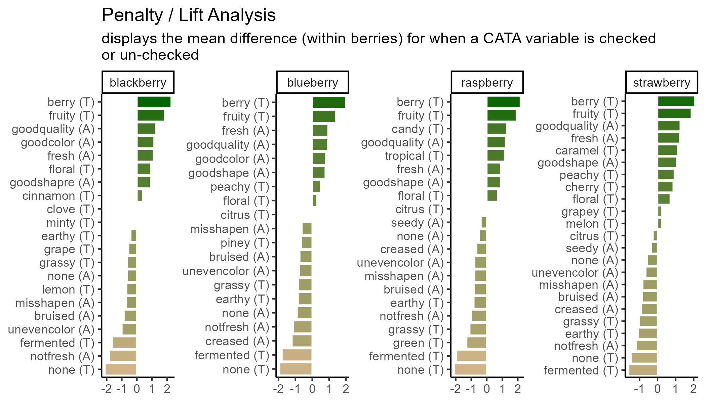

# Appendix {-}


## Using ggplot2 with other packages {-}
As you might have noticed, we had you download more packages than just `ggplot2` for this tutorial. `ggplot2` is a framework and will help you make many standard plots, but it can't do everything. Or, sometimes, you may not want to use it to do everything yourself.

Packages meant to work with `ggplot2` to more easily make specific kinds of visualizations are also called ggplot **extensions**. The four most common kinds of ggplot extensions are:

1. Packages that add `geom_*()s` or `stat_*()`s for new kinds of plots
2. Packages that add `theme_*()`s and `scale_*()`s for specific color or style needs
3. Packages that make `ggplot` objects, so you never write `ggplot()` yourself
4. Packages that combine multiple plots in various ways

You can view many of these extensions [on the tidyverse website](https://exts.ggplot2.tidyverse.org/gallery/) (where you'll also see many examples that fall into multiple of these categories or don't fit into the categories here at all).

### New `theme_*()`s and `scale_*()`s {-}
Most of the additional `geom_*()`s in `ggplot2` extensions involve some sort of calculation, so the confidence that you're using someone else's algorithm that's (hopefully!) been double-checked is a real benefit. You've already seen how to change the way your plots look with `theme()` one argument at a time, and how to set `scale_*_manual()` if you have the exact colors or color range that you want.

So there's nothing these prettying-up packages will do that you can't do yourself, but there are a huge number of `ggplot2` extensions that include some version of a no-gridline minimal theme for convenience. Such as:


``` r
berry_long_liking %>%
  ggplot(aes(x = Scale, y = Liking, color = Scale)) +
  ggbeeswarm::geom_quasirandom() +
  facet_wrap(~ Attribute) +
  cowplot::theme_minimal_hgrid()
```


Packages that added `scale_*()`s used to be one of the most common kinds of ggplot extensions (because, as you'll notice, the above figure with the default color scale is not red-green colorblind friendly), but the most popular scales now come with `ggplot2` itself.

`RColorBrewer`'s colorblind- and printer-friendly palettes for categorical data are now available in `ggplot2::scale_*_brewer_*()`, and you've already seen us use the `viridis` color palettes in `ggplot2::scale_*_viridis_*()`. The `viridis` color scales *can* be used for categorical data, if you use the `_d()` versions, but they were designed for ordinal and binned data, since some colors will seem more related than others. See [Chapter 4](https://clauswilke.com/dataviz/color-basics.html) and [Chapter 19](https://clauswilke.com/dataviz/color-pitfalls.html) of Claus O. Wilke's book *Fundamentals of Data Visualization*.

### Finding New Packages {-}

This isn't all the functionality of any of these packages, and these aren't the only packages that add new features to `ggplot2`.

If you're trying to figure out how to create a type of plot you've never made before, we'd recommend:

1. Ask yourself what variables are represented by the x and y axes, the shapes, the line types, or the colors. Think about whether you can build the plot from smaller components. Is it a grid of scatterplots with colored contour regions? How much of the plot is just points, lines, or rectangles with fancy formatting? You can do **a lot** with just `ggplot2`!
2. See if any of the packages in [the list of registered ggplot extensions](https://exts.ggplot2.tidyverse.org/gallery/) have a plot similar to yours. These packages tend to have very thorough and visual documentation.
3. If it's a sensory-specific plot, [check out the `R` Opus v2](https://jlahne.github.io/r-opus-v2/index.html). Almost all of the plots only use `ggplot2`, `patchwork`, and `ggrepel`.
4. Use a web search with the kind of plot you want to make and the keyword "ggplot2" to find tutorials or discussions with example code. Results from [Stack Overflow](https://stackoverflow.com/questions/tagged/ggplot2), [Data to Viz](https://www.data-to-viz.com/), or [`R` Graph Gallery](https://r-graph-gallery.com/index.html) are all likely to have good explanations and useful examples, while anything with "(# examples)" in the article name is likely to be very basic material with good SEO.

Keep in mind that keywords primarily used in sensory science, say "preference map" or "penalty analysis", are unlikely to yield examples in `ggplot2` with extensive results. In my own process of troubleshooting and double-checking for this workshop, I've found some helpful examples by searching "add density contours to 2d scatterplot ggplot" or "ordered bar plot positive and negative ggplot".

Package documentation might come up while you're looking, but the examples are often very abstract and simple, and they're often structured around names of functions rather than concepts, so it's often faster to see some examples of real plots that other people (who aren't writing an entire `R` package) wanted to make and then looking up the functions they used to do so.

### Modifying `ggplot()`s made by other packages {- #ggextend}
In the workshop, we made almost all of our plots by calling `ggplot()` and then adding on geoms, themes, labels, scales, and facets with `+`, and we briefly alluded to why this is in [Chapter 1](#pubquality). But some packages *do* utilize `ggplot2` by making a whole plot for you with their own internal call to `ggplot()`, including `FactoMineR`, *and* you've seen us keep adding things to plots we've saved in variables. If you find yourself just slightly wanting to tweak the plot a package is saving to a variable (or a list, for several plots), it *may* be possible to do so with `+` semantics, instead of recreating the whole plot yourself. That's what this section of the appendix will walk through.


``` r
#FactoMineR uses ggplot for its internal plotting,
#Which is why we can assign the output to a variable
#and not see the plot right away
#(although the CA() function will also display several plots by default)
cider_contingency %>%
  FactoMineR::CA(graph = FALSE) %>%
  FactoMineR::plot.CA() -> ca_cider_biplot_facto

#The ca package, meanwhile, uses base plotting.
#You can tell because it prints this plot immediately.
cider_contingency %>%
  ca::ca() %>%
  ca::plot.ca() -> ca_cider_biplot_green
```


You can see that the last code chunk only output one plot right away, but we can confirm our suspicions with the base `R` `class()` function.


``` r
class(ca_cider_termplot) # Made with ggplot() ourselves
```

```
## [1] "gg"     "ggplot"
```

``` r
class(ca_cider_biplot_facto) # Made with ggplot-based FactoMineR
```

```
## [1] "gg"     "ggplot"
```

``` r
class(ca_cider_biplot_green) # Made with ca::ca(), not a plot at all
```

```
## [1] "list"
```

``` r
ca_cider_biplot_green # It's two tables of coordinates!
```

```
## $rows
##                          Dim1        Dim2
## 1911 Est. Chilled -0.30922746  0.02323046
## 1911 Est. RT      -0.33096663  0.04492088
## Buskey Chilled     0.01508206 -0.16463573
## Buskey RT          0.19222871 -0.19341072
## Eden Chilled       0.22460300  0.13702229
## Eden RT            0.20122093  0.14661009
## 
## $cols
##                     Dim1        Dim2
## Fresh_Apples -0.30305451  0.08260444
## Fermented     0.05136995 -0.11123214
## Herbal        0.27953814  0.05798442
## Dry           0.09068713 -0.09458987
## Spice         0.09194648 -0.15607561
## Fruity       -0.26360780  0.04401256
## Smooth       -0.23141023 -0.16865980
## Alcohol       0.08456228 -0.05135981
## Light        -0.13444990 -0.13768159
## Sweet        -0.13152453 -0.06963735
## Woody         0.32164765  0.18574435
## Berries      -0.38694032  0.08324652
## Sour         -0.03153644  0.19917586
## Funky         0.56153039 -0.01014260
## FullBodied   -0.01727177 -0.10673686
## Metallic      0.13770506  0.36391448
## Floral        0.05665116 -0.01517803
## Candy        -0.73752932  0.35245085
## Bitter        0.17535866 -0.02812715
## Vomit         0.43823154  0.03719609
## Earthy        0.43043925 -0.06405187
## Synthetic     0.35094003  0.33924051
```

What this means is that we can look at the `FactoMineR`-made plot we've saved to `ca_cider_biplot_facto`:


``` r
ca_cider_biplot_facto
```


*And* we can still change up many of the elements by adding additional elements, although you're likely to get some weird warning messages *and* some silent errors. (The `ggrepel` error message is actually just because there are too many `geom_text_repel()` labels close-together in a small plots, because expanding `xlim()` crowds everything in the center of the plot.)


``` r
ca_cider_biplot_facto +
  theme(panel.grid = element_blank(), # Removes the axis lines
        plot.title = element_blank()) + # Removes the title
  xlim(-1,1) + # Extends the x limits, with a warning
  scale_color_brewer(type = "qual", palette = "Dark2")
```


``` r
  # Silently fails to change the color scale
```

You can't just `+ scale_color_*()` to a `FactoMineR` plot, because the `ggplot` already has a non-default color scheme and adding a second color scale does nothing. If you look at the help file for `?FactoMineR::plot.CA`, you can set several styling parameters when you're making the plot, and you can remake it as many times as you need, but doing so does have significantly less flexibility than the approach to plotting we've outlined in this workshop.

We also can't go back and adjust the parameters passed to `geom_text_repel()` after the fact, even though we can tell from the warning messages that that's the package being used to put the attribute and product names onto the biplot.

It will almost always be possible to add more `geom_*()`s to plots made by other packages, as long as you don't mind them being added *on top of* any existing elements in the plot.


``` r
liking_arrow <- data.frame(x1 = 0, y1 = 0, x2 = -0.4, y2 = -0.1, text = "Liking")

ca_cider_biplot_facto +
  geom_segment(aes(x= x1, y = y1, xend = x2, yend = y2), color = "orange",
               arrow = arrow(length = unit(0.03, "npc")), linewidth = 1,
               data = liking_arrow) +
  geom_text(aes(x = x2, y = y2, label = text), color = "orange",
            hjust = "outward", vjust = "outward", fontface = "italic",
            data = liking_arrow)
```


If you desperately need to [change a scale or reorder `geom_*()`s from an existing `ggplot`](https://cran.r-project.org/web/packages/gginnards/vignettes/user-guide-2.html#replacing-scales-coordinates-whole-themes-and-data.) in a hurry, look into the `gginnards` package.

## Combining Plots {-}
During the workshop, we showed how to use `facet_*()` to view "small multiple" plots side-by side:


``` r
raw_cider_data <- read_csv("data/CiderDryness_SensoryDATA.csv")

raw_cider_data %>%
  pivot_longer(Fresh_Apples:Synthetic) %>%
  group_by(Sample_Name, Temperature, name) %>%
  summarize(total = sum(value)) %>%
  ggplot(aes(x = interaction(Sample_Name, Temperature), y = total)) + 
  geom_col(aes(fill = Sample_Name)) +
  scale_fill_manual(values = wesanderson::wes_palettes$FantasticFox1) + 
  coord_flip() + 
  labs(x = NULL, y = NULL, fill = NULL) +
  theme_bw() + 
  theme(legend.position = "top",
        panel.grid = element_blank()) -> cider_count_plot

cider_count_plot +
  facet_wrap(~name, ncol = 6)
```


This works very well whenever you have multiple plots using the same `geom_*()`s that you want to show on the same axes, and you can even adjust the axis limits from facet to facet using `scales = "free*"`:


``` r
cider_count_plot +
  facet_wrap(~name, ncol = 6,
             scales = "free_x") # Each plot now has a different x-axis
```


Not that we'd argue you *should* here. Also, take note that the `x` in `free_x` refers to the horizontal axis in the final plot, *after* the `coord_flip()`, and *not* the `x` aesthetic we set in the `ggplot()` call.

But if you have different plot types entirely (different data sources, different `geom_()`s, or different categorical axes) that you want to place side-by-side, say a loading plot and the product map resulting from a PCA or MFA, you're going to need something to paste together multiple `ggplot_()`s.

The easiest way to do this is using `patchwork`, which will work on ggplots you've made yourself *or* with ones made by packages like `FactoMineR`. *When you have `patchwork` loaded*, the `+` operator will put two plots side-by-side:


``` r
library(patchwork)

berry_mfa_summary %>%
  FactoMineR::MFA(group = c(sum(str_detect(colnames(berry_mfa_summary), "^cata_")),
                            sum(str_detect(colnames(berry_mfa_summary), "^liking_"))),
                  type = c("f","s"), graph = FALSE,
                  name.group = c("CATA","Liking")) -> berry_mfa_res

plot(berry_mfa_res, choix = "var") + plot(berry_mfa_res, partial = "all")
```


And the `/` operator will arrange two plots vertically:


``` r
plot(berry_mfa_res, choix = "var") / plot(berry_mfa_res, partial = "all")
```


The advantage of doing this with a package like `patchwork`, rather than saving separate images, is that it aligns all of the plot areas precisely and that they will more easily move or rearrange certain plot elements like legends and axis labels.


``` r
plot(berry_mfa_res, choix = "var") + plot(berry_mfa_res, partial = "all") +
  plot_layout(guides = "collect") &
  theme(plot.title = element_blank(),
        legend.position = "bottom")
```


The `&` operator lets you add elements like themes or annotations to all of the plots you've combined together. `plot_layout()` is a `patchwork` function that lets you set relative plot sizes, decide how to arrange more than 2 plots, and move legends:


``` r
plot(berry_mfa_res, partial = "all") +
  (plot(berry_mfa_res, choix = "var") +
  plot(berry_mfa_res, choix = "freq", invisible = "ind")) +
  plot_layout(guides = "collect", ncol = 1, widths = 2) &
  theme(plot.title = element_blank(),
        axis.title = element_blank(),
        legend.position = "bottom")
```


If you want to put images anywhere on a visualization, you're struggling to make a complex arrangement with `patchwork`, or you have an `R` `list` structure containing multiple plots (say, the result of a `for` loop, `*apply()`, or `nest()` call), then `cowplot` is another option:


``` r
berry_mfa_res$separate.analyses %>%
  lapply(function(x) {
    x$ind$coord %>%
      as_tibble(rownames = "Berry") %>%
      ggplot(aes(x = Dim.1, y = Dim.2)) +
      geom_point()
  }) %>%
  cowplot::plot_grid(plotlist = ., labels = names(.))
```


``` r
#You can also pipe your list into patchwork::wrap_plots()
#if you have the latest version of patchwork.
#It's a fairly new package, so it gains big new features very often.
```

Both of these packages can also add letters and other labels to each plot:


``` r
plot(berry_mfa_res, choix = "var") + plot(berry_mfa_res, partial = "all") +
  plot_layout(guides = "collect") +
  plot_annotation(tag_levels = 'A') &
  theme(plot.title = element_blank(),
        legend.position = "bottom")
```


``` r
cowplot::plot_grid(plot(berry_mfa_res, choix = "var"),
                   plot(berry_mfa_res, partial = "all"),
                   labels = "AUTO")
```


``` r
#Cowplot doesn't have a way to combine or move legends.
#You'd have to move the legends *before* using plot_grid()
```

If you need to move or realign the labels so they're not overlapping anything, in `patchwork` you can add `theme(plot.tag.position = c(X, Y))` to individual plots with `+` or to the whole grouping of plots with `&`. The `cowplot::plot_grid()` function has arguments `labels_x` and `labels_y`, which let you adjust the distance from the bottom left hand corner of the figure.


``` r
plot(berry_mfa_res, choix = "var") + theme(plot.tag.position = c(0.2, 0.95)) +
  plot(berry_mfa_res, partial = "all") + theme(plot.tag.position = c(0.12, 0.95)) +
  plot_layout(guides = "collect") +
  plot_annotation(tag_levels = 'A') &
  theme(plot.title = element_blank(),
        legend.position = "bottom")
```


``` r
cowplot::plot_grid(plot(berry_mfa_res, choix = "var"),
                   plot(berry_mfa_res, partial = "all"),
                   labels = "AUTO",
                   label_y = 0.8)
```


You can also use any image editing, publishing, or graphics software to manually combine, arrange, and label plots, but if you need to make changes to a plot later then doing your layout *in `R`* will mean you just have to run the lightly-updated code again to re-export a fully formatted multi-part figure, even if the plot dimensions change.

## Image File Types, Sizes, and Resolutions {- #ggformat}

### What image format? {-}

There are two major ways to save the kind of spatial color data that comprise images such as graphs. You can store them as **vector graphics**, which can be rescaled because they're made up of lines and shapes (most commonly, `.pdf` and `.svg`) or as **raster (bitmap) graphics**, which store images as a grid of **pixels** which each have a single uniform color (most commonly, `.png` and `.jpeg`).

-  `.pdf` vector images are best for **LaTeX** and professional publishing
-  `.svg` vector images are more widely supported in word processors and websites
-  `.png` raster images are the most predictable to print, the best for web publishing, and can be used in pretty much every software ever made, *if* you know exactly the size you want. 
-  `.jpeg` (along with `.tiff`) raster images are the raster format preferred by *Food Quality and Preference* editors. They are worse for web publishing than `.png` but share its other advantages and usually take up less storage space.

`ggsave()` supports all of the above-named image formats, as well as `.eps`, `.ps`, `.tex` (pictex), and `.bmp`. It will figure out from the file extension (the stuff after the `.` in the `filename` argument) what image type it's saving as, but you can also specify it explicitly with the `device` argument.

If you're reading this right now, you're looking at a webpage created using `bookdown` and `knitr`. We can't actually directly embed `.pdf` images in this site, but let's look at a few other example formats using the same plots.


``` r
ggsave("img/penalty-lift-svg.svg", p1_berry_penalty)
ggsave("img/penalty-lift-jpeg.jpeg", p1_berry_penalty)
ggsave('img/penalty-lift-png.png', p1_berry_penalty)
```

Now let's compare how each of these looks! First, inside R:


``` r
p1_berry_penalty # If you're following along, this will look different in your R session!
```


The `.svg` image made by `ggsave()`:


The `.png` image made by `ggsave()`:


The `.jpeg` image made by `ggsave()`:


The two raster formats look basically the same, and only slightly different from the `.svg` and the version in the `.html` version of this tutorial. If you're following along in your own `R` session, however, you'll notice that these saved plots all look more similar to each other than they do to the initial plot you're previewing inside `R`. *All* of the plots have a bit more space around the text using `ggsave()`, taller bars, and a different aspect ratio ($width/height$).

We can adjust these using the rest of the arguments to `ggsave()`. The `width`, `height`, and `units` primarily control the image size (for raster images) and aspect ratio (for all images), but they also affect the relative size of plot elements. Larger plots will have axis labels, text, and `geom_*()`s that take up less of the overall plotting area, and vice-versa for smaller images.

If you get to this stage with a **vector image** and realize that all of the fixed-size elements (e.g., text) are too big or too small, you can use `ggsave()`'s `scale` argument. `scale` < 1 makes all the fixed-size elements *smaller* relative to the plot size and `scale` > 1 makes all the elements *bigger* relative to the plot size. `scale` < 1 will generally also give you a *larger plot area* and *more space between your geoms*.


``` r
ggsave("img/penalty-lift-svg-7x4.svg", p1_berry_penalty,
       width = 7, height = 4, units = "in")

ggsave("img/penalty-lift-svg-14x8.svg", p1_berry_penalty,
       width = 14, height = 8, units = "in")

ggsave("img/penalty-lift-svg-14x8-rescale.svg", p1_berry_penalty,
       width = 14, height = 8, units = "in", scale = .5)
```

The 7x4" vector plot:


The same plot saved at 14x8":


A 14.8" plot with `scale = 0.5`:


All of these `.svg` images are *displayed* at 7x4" on your screen, but the plot we made with `width = 14, height = 8` has smaller text and larger plotting areas unless we correct this with `scale`. `penalty-lift-svg-7x4.svg` and `penalty-lift-svg-14x8-rescale.svg` are actually identical files.

You should *avoid using `scale` for rasters*, as it will create plots that will not print at the size (`width` and `height`) and resolution (`dpi`) you specified. If you find yourself wanting to change the `scale` of a raster image, you should refer to the reference we've put together on `dpi` in the [Appendix](#ggresolution).

### Simpler Sizing: Vector Images {-}
You might be surprised that vector images have height and width options, because we said they don't have a fixed display size, but as you saw in [Chapter 3](#ggsave), `ggsave()` picked a default image size of 7x7 inches when we didn't specify. The height and width are mostly important for determining the relative sizing of elements like text and whitespace.

`ggplot2` actually saves the sizes of certain plot elements, namely *text* and most `geom_*()`s, in inches or millimeters. When it has to construct an actual version of the plot at a given size, it tries to keep all of the 12-pt text 1/6" tall (1 inch = 72 points). This 12-point font will take up a very small amount of a 4-foot-tall image, but a sixth of a 1" image.

The fact that you can then print the `.svg` at any size you want is out of `ggplot2`'s hands. It will try to make the fonts and elements the right size for the size you're *telling it* you will print.

This means that the `scale` argument of `ggsave()`, for vectors, can just change the output size as long as you keep the same aspect ratio. It doesn't change the number of points per inch, and it doesn't change the point-size of any fonts or other elements in the plot. It's easier to just print a different size figure.

If you try to use this same trick for raster images, your picture **will not be $width \times dpi$ pixels wide**. This has flummoxed many a researcher trying to export very large, crisp figures for a poster.

### Raster Image Resolutions {-}

All raster images are made up of grids of dots or pixels. Once you export a figure from `R` as a `.png`, `.jpeg`, or other raster format, *you cannot resize it*. It will look blurry or blocky if you try to make it bigger, and even slight changes to the **aspect ratio** ($width/height$), the text and other plot elements will be noticeably stretched out.

You'll have fewer problems if you save an image that's way too big (i.e., has too many pixels) for what you need, so long as it's the right aspect ratio and all the plot elements have relative sizes that work at the scale you'll be printing. (See [this short primer on "Using `R` Plots in Documents" from the University of Wisconsin-Madison](https://sscc.wisc.edu/sscc/pubs/using-r-plots/saving-plots.html#file-dimensions) for examples.)

So, how big is a pixel? How many pixels are in an inch? It depends! (On the pixel density for screens and the resolution for printing, see [the discussion on this page](https://graphicdesign.stackexchange.com/questions/6080/what-is-the-difference-between-dpi-dots-per-inch-and-ppi-pixels-per-inch) for details.)

- Most modern computer monitors have something like 90-120 pixels per inch (ppi)
- Microsoft Powerpoint uses an internal resolution of 96 ppi as a default, [although images will print at more than 96 dpi if they're sized appropriately](https://www.brightcarbon.com/blog/powerpoint-picture-size-and-resolution/).
- Older Apple software has a default of 72 ppi
- `ggsave()` uses a default of 300 dpi
- Poster printers will usually print at 300 dots per inch (dpi). They may ask for a minimum resolution of anywhere between 120-300 dpi, although 300 dpi will usually be a safe bet. Use your specific printer's recommendations.
- Elsevier journals like *Food Quality and Preference* [suggest at least 300 dpi for all images and at least 500 dpi for "combination art", which includes all `R` plots with colored or shaded areas](https://www.elsevier.com/about/policies-and-standards/author/artwork-and-media-instructions/artwork-sizing).

This is important because, if you have a 600x600-pixel raster image, and you try to print it any bigger than 2 inches x 2 inches on a 300 dpi printer, then you have *missing image data* and the printed version will look blurry.

Whenever something, like a design software or an `R` function to save a plot, gives you the chance to enter an image size in inches or centimeters, *you should figure out what dpi or ppi it's using*. It may be easier to figure out the final pixel size you want and export something that size or bigger. (For more details, see [this guide on "Preparing Images for PowerPoint, the Web, and Publication" from the University of Michigan](https://apps.lib.umich.edu/files/services/exploratory/pdfs/preparingimages.pdf). It's slightly outdated, so ignore the specific dpi/ppi numbers.)

You can see the possible image widths and corresponding pixel sizes for Elsevier journals [here](https://www.elsevier.com/about/policies-and-standards/author/artwork-and-media-instructions/artwork-sizing). For PowerPoint presentations, assume you're filling a 13.3x7.5" space at 150 dpi. For printed posters, you'll find the final poster size on the competition guidelines and the final resolution from your printer. 12"x12" for a single figure at 300 dpi is a good place to start.

You *will* almost certainly have to re-export your figures several times in order to get the sizing and aspect ratios right.

Let's save a the same plots as a raster image (`.png`) with a few different `dpi` values.


``` r
ggsave("img/penalty-lift-png-50dpi.png", p1_berry_penalty,
       width = 7, height = 4, units = "in", dpi = 50)

ggsave("img/penalty-lift-png-300dpi.png", p1_berry_penalty,
       width = 7, height = 4, units = "in") #default dpi = 300

ggsave("img/penalty-lift-png-500dpi.png", p1_berry_penalty,
       width = 7, height = 4, units = "in", dpi = 500)
```

7x4" at 50 dpi:


7x4" at 300 dpi (the `ggsave()` default):



7x4" at 500 dpi:


You can see that all of the 7x4" raster plots look basically the same, except the first one is a little blurry when it's sized up to match the other two on your probably ~100 dpi monitor. This is the problem we're trying to avoid.

Unlike `scale`, the `dpi` argument does not resize any of the text or geoms (it doesn't change the size of a "point" from 1/72"). But let's say we need a 300 dpi copy of this image printed at 14x8". We already know that the 14x8" output has text that's too small to read from afar.

In cases like these, it may be easier to output a size with the right *aspect ratio* that looks good and is legible, then figure out what `dpi` you'll need to print it. If we need a 14x8" plot at 300 dpi, that's $14 \times 300 = 4200$ pixels wide by $8 \times 300 = 2400$ tall. We can fake this with our 7x4" plot at 600 dpi, since $4200 / 7 = 600$ and $2400 / 4 = 600$.

### Other Image Export Options

This is not a `knitr` or `bookdown` tutorial, but we used the `bookdown` package to make the [online webpage version of this tutorial](https://jlahne.github.io/pangborn-tutorial-2025/). It comes with its own advantages and challenges, but it does significantly streamline the image-generation process for any project where the only file you need is one LaTeX file, `.html` page, or `.pdf` output with all of the text and all of the figures. If that sounds appealing to you, turn your attention to ["bookdown: Authoring Books and Technical Documents with `R` Markdown" by Yihui Xie](https://bookdown.org/yihui/bookdown/).

## Specifying Ordinal Variables as Factors {- #factororder}
In [Chapter 3](#reorderwithin), we discussed the easiest way to adjust the order that levels of a categorical variable show up in plot axes for different facets, using `tidytext::reorder_within()`. You may want to have more fine-tuned control over the order, or you may need to adjust the order for an aesthetic that isn't necessarily the `x` or `y` axis. You can do this with `factor`s.

You can manually specify each level in order to `factor(x, levels = c(...))`:


``` r
berry_penalty_analysis_data %>%
  filter(str_detect(cata_variable, "taste")) %>%
  mutate(cata_variable = factor(cata_variable,
                                levels = c("taste_fruity",
                                           "taste_melon", "taste_peachy", "taste_grapey", "taste_grape",
                                           "taste_berry", "taste_cherry",
                                           "taste_citrus", "taste_lemon",
                                           "taste_tropical",
                                           "taste_candy", "taste_caramel",
                                           "taste_green", "taste_grassy", "taste_piney", "taste_minty",
                                           "taste_earthy", "taste_fermented",
                                           "taste_cinnamon", "taste_clove",
                                           "taste_floral",
                                           "taste_none"))) -> berry_penalty_manual_factors

berry_penalty_manual_factors %>%
  ggplot(mapping = aes(x = cata_variable, y = penalty_lift)) +
  geom_col(aes(fill = penalty_lift), color = "white", show.legend = FALSE) + 
  facet_wrap(~berry, nrow = 1) +
  coord_flip() + 
  theme_classic()
```


Note that the attribute you list *first* when you're specifying the `levels` will become 1, then 2, then 3. With `coord_flip()`, that puts it at the bottom of the plot.


``` r
berry_penalty_manual_factors %>%
  distinct(cata_variable) %>%
  mutate(variable_number = as.numeric(cata_variable))
```

```
## # A tibble: 22 × 2
##    cata_variable   variable_number
##    <fct>                     <dbl>
##  1 taste_berry                   6
##  2 taste_cinnamon               19
##  3 taste_clove                  20
##  4 taste_earthy                 17
##  5 taste_fermented              18
##  6 taste_floral                 21
##  7 taste_fruity                  1
##  8 taste_grape                   5
##  9 taste_grassy                 14
## 10 taste_lemon                   9
## # ℹ 12 more rows
```

This gives us control, but it's pretty annoying to write out for large lists of attributes, and you have to be sure the spelling and capitalization match exactly. Often, like with the penalty analysis plots, what we actually want to do is order the Attributes in terms of some other numerical variable, like frequency or size of penalty.

One way is to `arrange()` the data the way you want it and then use that order to specify the levels.


``` r
berry_penalty_analysis_data %>%
  # Counting the number of times each attribute is used across all products:
  group_by(cata_variable) %>%
  mutate(variable_count = sum(count)) %>%
  ungroup() %>%
  # Arranging from least-to-most used:
  arrange(variable_count) %>%
  # Converting to a factor, so the least-used will be 1st, then the next:
  mutate(cata_variable = factor(cata_variable, levels = unique(cata_variable),
                            ordered = TRUE),
         variable_number = as.numeric(cata_variable)) -> berry_penalty_frequency_factors

#Now the plot:
berry_penalty_frequency_factors %>%
  ggplot(mapping = aes(x = cata_variable, y = penalty_lift)) +
  geom_col(aes(fill = penalty_lift), color = "white", show.legend = FALSE) + 
  facet_wrap(~berry, nrow = 1) +
  coord_flip() + 
  theme_classic()
```


You'll notice that our reordered categorical axes still have the same order across all of the facets This would be true even if we used the within-product sums already in the `count` column to calculate `level`s. The order is based on factor levels, which are fixed within each column: `Fresh_Apples` can't be "more than" `Dry` in one part of the `cata_variable` column and "less than" in another part.

Lastly, there's a base `R` version of `reorder`, which is a bit more compact because it does the summarizing, grouping, and ordering all in one function:


``` r
berry_penalty_analysis_data %>%
  mutate(cata_variable = reorder(cata_variable, count, sum)) %>%
  ggplot(mapping = aes(x = cata_variable, y = penalty_lift)) +
  geom_col(aes(fill = penalty_lift), color = "white", show.legend = FALSE) + 
  tidytext::scale_x_reordered() +
  facet_wrap(~berry, scales = "free", nrow = 1) +
  coord_flip() + 
  theme_classic()
```


This also works to reorder variables for aesthetics other than `x` and `y`, like `color`, `fill`, and `linewidth`, controlling which part of the scale they're mapped to and what order they show up in on the legend.

## Regular Expressions {- #regex}
A regular expression, or regex, is a way of compactly writing a `pattern` that will let you match similarly-structured pieces of text. You may use regex because you want the list of matches itself, because you want to do something to pieces of text with a certain pattern somewhere in them, or because you want to replace all matches with something else. Regex were originally designed in the 1980s, and are also a central part of the design of the `stringr` package (although `stringr` still has a lot of useful tools without them).

If you wanted to match all words ending in "ly", you could use `\\b\\w+ly\\b`, which looks for a word boundary (`\\b`), followed by at least one (`+`) "word character" (`\\w`, mostly letters), followed by the letters "ly", followed by another word boundary. You can use a similar regex to find all integers (`\\b\\d+\\b`) or expand it to find integers *and* numbers with a decimal (`\\b\\d+(\\.\\d+)?\\b`).

Mostly, Regex are very powerful and very difficult to read. We'll provide a few semi-realistic examples in action to show off just how powerful they can be, and just how messy they look:


``` r
str_extract("If you want to get in touch with me you can do so at hamilton@flavorlinguist.com.",
            "\\w*@\\w+\\.(edu|gov|com|org|biz|net|fr|co\\.uk)\\b")
```

```
## [1] "hamilton@flavorlinguist.com"
```

``` r
str_extract_all("Our 300th measurement was 10.31 cm, our 301st clocked in at 3.213in",
            "\\d+\\.\\d+ ?(cm|in|m)")
```

```
## [[1]]
## [1] "10.31 cm" "3.213in"
```

``` r
str_extract_all("Regular Expressions (regex) are one tool in Natural Language Processing (NLP)",
            "(?<=\\()[^)]*(?=\\))")
```

```
## [[1]]
## [1] "regex" "NLP"
```

You can try changing the searched `string` in the above code to see if it recognizes your email or how many numbers you can get it to recognize. Usually, though, your plot labels aren't in full sentences in your data frame. Simpler regular expressions can still save you a lot of work. Without regular expressions, our main penalty analysis example has to `separate()` the CATA variable names into two parts, use a `case_when()` to individually match the modalities to a cleaned-up "(A)" or "(T)", and then finally `unite()` them back into one column:


``` r
berry_penalty_analysis_data %>%
  select(-count) %>%
  pivot_wider(names_from = checked,
              values_from = penalty_lift,
              names_prefix = "checked_") %>%
  separate(cata_variable, 
           into = c("mode", "variable"), 
           sep = "_") %>%
  mutate(mode = case_when(mode == "taste" ~ "(T)",
                          mode == "appearance" ~ "(A)",
                          mode == "appearane" ~ "(A)")) %>%
  unite(variable, mode, col = "cata_variable", sep = " ")
```

```
## # A tibble: 85 × 4
##    berry      cata_variable   checked_0 checked_1
##    <chr>      <chr>               <dbl>     <dbl>
##  1 blackberry fresh (A)            4.70      5.80
##  2 blackberry goodcolor (A)        4.63      5.77
##  3 blackberry goodquality (A)      4.69      5.96
##  4 blackberry goodshapre (A)       4.93      5.86
##  5 blackberry misshapen (A)        5.63      4.92
##  6 blackberry none (A)             5.42      4.78
##  7 blackberry notfresh (A)         5.57      3.76
##  8 blackberry unevencolor (A)      5.53      4.53
##  9 blackberry bruised (A)          5.53      4.67
## 10 blackberry berry (T)            4.21      6.49
## # ℹ 75 more rows
```

With regular expressions, you can combine all of this in one step:


``` r
berry_penalty_analysis_data %>%
  select(-count) %>%
  pivot_wider(names_from = checked,
              values_from = penalty_lift,
              names_prefix = "checked_") %>%
  mutate(cata_variable = str_replace(cata_variable,
                                     "^(.).*_(.*)",
                                     "\\2 (\\1)"),
         cata_variable = str_to_title(cata_variable))
```

```
## # A tibble: 85 × 4
##    berry      cata_variable   checked_0 checked_1
##    <chr>      <chr>               <dbl>     <dbl>
##  1 blackberry Fresh (A)            4.70      5.80
##  2 blackberry Goodcolor (A)        4.63      5.77
##  3 blackberry Goodquality (A)      4.69      5.96
##  4 blackberry Goodshapre (A)       4.93      5.86
##  5 blackberry Misshapen (A)        5.63      4.92
##  6 blackberry None (A)             5.42      4.78
##  7 blackberry Notfresh (A)         5.57      3.76
##  8 blackberry Unevencolor (A)      5.53      4.53
##  9 blackberry Bruised (A)          5.53      4.67
## 10 blackberry Berry (T)            4.21      6.49
## # ℹ 75 more rows
```

And you can even go farther by combining multiple replacements (for typos, for adding in spaces, etc) in one call to `str_replace_all()`.


``` r
berry_penalty_analysis_data %>%
  select(-count) %>%
  pivot_wider(names_from = checked,
              values_from = penalty_lift,
              names_prefix = "checked_") %>%
  mutate(cata_variable = str_replace_all(cata_variable,
                                         c("^(.).*_(.*)" = "\\2 (\\1)",
                                           "good" = "good ",
                                           "not" = "not ",
                                           "shapre" = "shape",
                                           "uneven" = "uneven ")),
         cata_variable = str_to_title(cata_variable))
```

```
## # A tibble: 85 × 4
##    berry      cata_variable    checked_0 checked_1
##    <chr>      <chr>                <dbl>     <dbl>
##  1 blackberry Fresh (A)             4.70      5.80
##  2 blackberry Good Color (A)        4.63      5.77
##  3 blackberry Good Quality (A)      4.69      5.96
##  4 blackberry Good Shape (A)        4.93      5.86
##  5 blackberry Misshapen (A)         5.63      4.92
##  6 blackberry None (A)              5.42      4.78
##  7 blackberry Not Fresh (A)         5.57      3.76
##  8 blackberry Uneven Color (A)      5.53      4.53
##  9 blackberry Bruised (A)           5.53      4.67
## 10 blackberry Berry (T)             4.21      6.49
## # ℹ 75 more rows
```

You do not *have* to learn regular expressions to clean up messy text, but being comfortable with them will (eventually) make you faster. You should at least learn the characters (`\`, `.`, `[`, `]`, `{`, `}`, `(`, `)`, `<`, `>`, `*`, `+`, `-`, `=`, `!`, `?`, `^`, `$`, and `|`) that will need to be **escaped** with two backslashes if you need to replace them. It will help you troubleshoot any weird results you get from the `str_*()` functions.

If you want to learn more, we'd recommend starting with [the `stringr` package's own vignette on regular expressions](https://stringr.tidyverse.org/articles/regular-expressions.html), which you can view with `vignette("regular-expressions", "stringr")`. If you want more practice, you can then follow along with the [RegexOne](https://regexone.com/) tutorial or [RegexTutorials](http://regextutorials.com/index.html).

Any "perl-flavored" regex tutorial or resource will work, with the exception that *you will have to double the number of backslashes (`\`)* to use them in `R`.

