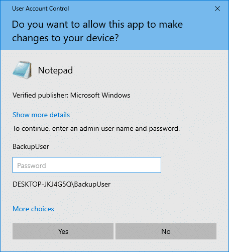
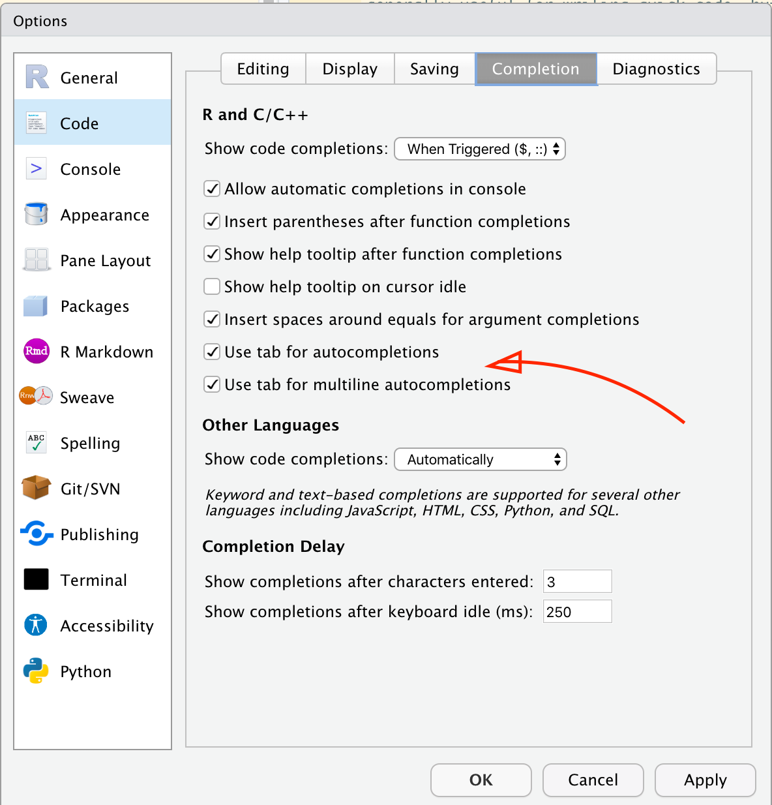
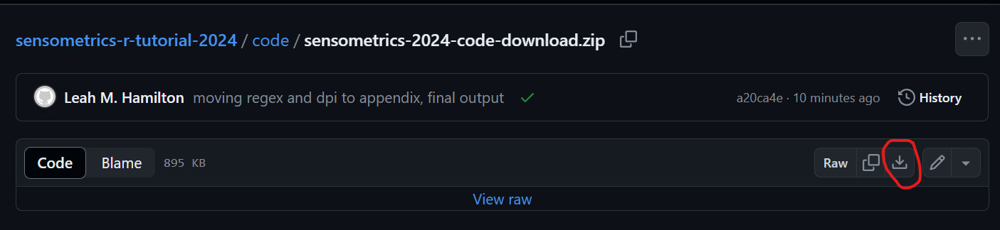

```{r setup, include = FALSE}
library(learnr)
#remotes::install_github("rstudio/gradethis")
library(gradethis) #to check results of exercises
knitr::opts_chunk$set(echo = FALSE)
options(tutorial.exercise.timelimit = 60, 
        tutorial.storage = "local")

set.seed(123)
clt_test <- data.frame(Product = rep(1:6, 20),
                       Assessor = rep(1:20, each = 6),
                       Liking = sample(1:9, prob = dnorm(1:9, mean = 8, sd = 1.5), size = 120, replace = TRUE))
  
dir.create("data",  showWarnings = FALSE)
write.csv(clt_test, "data/20250112_clt_data.csv", row.names = FALSE)

set.seed(456)
wine_key <- data.frame(Product = sample(101:999, 12),
                       Country = c("USA", "USA", "USA", "France", "France", "Other",
                                   "South Africa", "South Africa", "Brazil", "Brazil", "China", "China"))

write.csv(wine_key, "data/wine_product_key.csv", row.names = FALSE)

set.seed(789)
berries_clt <- data.frame(Product = rep(1:6, each = 80),
                          Sweetness = round(rnorm(80*6, mean = 6 + rep(1:6, each = 80)), 1))

berries_clt$Liking <- round(5 + (berries_clt$Sweetness / 5) - rnorm(80*6, 1, 1))
berries_clt$Liking[berries_clt$Liking < 1] <- 1
berries_clt$Liking[berries_clt$Liking > 9] <- 9

write.csv(berries_clt, "data/20200101_berries_clt.csv", row.names = FALSE)
```

## Introduction
This step-by-step walkthrough has two parts:

1. Instructions to download the required software and check that it's set up correctly, which **all** participants should complete as soon as possible using the **computer you will bring to the workshop**.
2. An **optional** series of exercises testing basic R knowledge like data types and using functions, which includes links to external resources. We recommend this for anyone nervous about their ability to keep up.

The first portion will take about 15 minutes to read and run the tests. If you don't yet have R and Rstudio on your laptop, it will take longer, depending on your internet speed and whether you need approval from you IT department.

The optional knowledge-check questions will take around 10-20 minutes to answer. If you need additional help, reading through various resources and practicing will take longer, possibly up to a few hours, but you can leave and come back at any time!

## Part 1: Required Software

In order to be prepared to participate for the in-person tutorial on publication-quality graphics in the tidyverse, you should bring a laptop that has the following installed:

* `R` (version 4.1.0 or newer)
* RStudio (version 2022.07.0 or newer)
* The `R` packages:
  + **tidyverse**
  + **tidytext**
  + **FactoMineR**
  + **ca**
  + **ggrepel**
  + **ggforce**
  + **cowplot**
  + **patchwork**
  + **wesanderson**
* The tutorial materials from our [GitHub](https://github.com/jlahne/pangborn-tutorial-2025/). You can download the data we'll use [here now](https://github.com/jlahne/pangborn-tutorial-2025/blob/main/code/pangborn-2025-data-download.zip), and the code files will be finalized about a week before the conference.

You may need help or pre-approval from your IT department if you will be using a work laptop. You should install all of these pieces of software and run the test code **before you travel** to minimize the setup necessary at the start of the tutorial. **Don't** plan to rely on internet access at the venue during/right before the tutorial--we're always the very first thing on the conference schedule, so there are often wi-fi issues still being worked out.

If you get stuck or need any help, email us at **jlahne at vt dot edu** and **hamilton at flavorlinguist dot com**.

## Installing R
You will need the free, open-source statistical programming language `R` installed to participate in the tutorial. This should be possible even on "managed" work computers--you can install `R` to your local profile without admin credentials.

If you have never used `R` on this computer before, install the newest version of `R` from [the CRAN website](https://cran.r-project.org/), following [these written instructions](https://researchguides.uoregon.edu/c.php?g=990393&p=10206421) or one of these videos:


If you are using a work-managed Windows computer, you may see a screen that looks like this:

{width=400px}

You can safely select "No" and proceed through local installation.

*If* you already have `R` on your computer, run `sessionInfo()` in the `R` console to make sure you are using version 4.1.0 or newer. The **tidyverse** is only compatible with versions of `R` from the last few years, and there are major updates periodically. You can have more than one version of `R` installed on one computer, although [keeping multiple versions of packages installed to go with it is more challenging and may require additional tools](https://scientifictools.org/article/12-is-it-possible-to-install-multiple-versions-of-r/).

### Setup check: R
Open your new copy of `R` and paste this code into the console:

`sessionInfo()$R.version$major`

Press the enter key to run the code.

```{r r-check, echo=FALSE}
question("What does the R console return when you run the above code?",
         answer("1"),
         answer("2"),
         answer("3"),
         answer("4", correct = TRUE),
         answer("5", message = "Woah! As far as we know, R version 5 isn't available yet. Make sure you run the code exactly as we typed it. If you did, email us for help."),
         incorrect = "You need R version 4.1.0 or newer for this tutorial. Please go to CRAN and install a new version of R.",
         allow_retry = TRUE)
```

## Installing RStudio
While you *can* do everything that we'll be demonstrating directly in the `R` console, as you did for the last question, it is difficult to keep track of your scripts, manage files, and preview plots with the regular `R` interface. We will be using **RStudio** to make this faster and easier. Unless you are already very comfortable with `R`, we recommend downloading RStudio.

RStudio is an "**I**nteractive **D**evelopment **E**nvironment" (IDE) for working with `R`. Without going into a lot of detail, that means that `R` lives on its own on your computer in a separate directory, and RStudio provides a bunch of better functionality for things like writing multiple files at once, making editing easier, autofilling code, and displaying plots.

### Downloading RStudio
Download the free version of [RStudio Desktop from the Posit website](https://posit.co/download/rstudio-desktop/#download)


If you are using a work-managed Windows computer, you may get stuck at a screen that looks like this:

{width=400px}

Unfortunately, you do need a system administrator to approve the RStudio installer on Windows PCs. If you are in this situation, reach out to your IT person **now** and ask them if RStudio is approved software and how to download it.

As a backup, you can create a [Free Posit Cloud Account](https://posit.cloud/plans) to use RStudio through your internet browser. This account is limited and requires an active internet connection, but it will allow you to complete the tutorial exercises as long as the conference wi-fi is working as expected.

### Changing your RStudio settings
Open RStudio. Look at the top menu, which starts with `File`, then `Edit`.

Navigate through this menu to `Tools > Global Options`.

Uncheck all the boxes that have to do with restoring projects and workspaces, so it matches this screenshot:

{width=400px}

You can see from the lefthand box that this was the `General` tab of the Global Options. Navigate to `Code > Completion` and select the checkboxes to allow using `tab` for autocompletions and allowing multiline autocompletions, as shown below:

{width=400px}

### Setup check: RStudio
Keep `R` or RStudio open. You will need it for the rest of this tutorial.

```{r rstudio-check, echo=FALSE}
question("Which of the following are headings under the `Code > Editing` tab of the RStudio Global Options? Check all that apply.",
         answer("Editing", correct = TRUE),
         answer("Execution", correct = TRUE),
         answer("Snippets", correct = TRUE),
         answer("Other Languages"),
         answer("R and C/C++"),
         answer("Workspace"),
         answer("History"),
         incorrect = "Make sure you look at the `Code > Editing` tab in your own RStudio download. The screenshots in this tutorial are of different settings tabs.",
         type = "multiple",
         random_answer_order = TRUE,
         allow_retry = TRUE)
```

## Installing R Packages
Keep `R` or RStudio open. You need to install the packages:

- **tidyverse**
- **tidytext**
- **FactoMineR**
- **ca**
- **ggrepel**
- **ggforce**
- **cowplot**
- **patchwork**
- **wesanderson**

You can do this by pasting the following code into the R(Studio) console:

```
install.packages(c("tidyverse", "tidytext", "FactoMineR", "ca", 
"ggrepel", "ggforce", "cowplot", "patchwork", "wesanderson"))
```

Hit the enter key on your keyboard to run.

If you have any issues or need more instructions, try watching one of these videos:


### Setup check: R packages
You can use `?` in `R` to pull up help files for any function in a package you have installed. Use the following code to read the help file for the function `geom_text_repel()` from the package `ggrepel`:

`?ggrepel::geom_text_repel`

You only have to read the two sentences under the **Description** heading. We don't expect you to understand what all of this means yet.

```{r rpackage-check, echo=FALSE}
question("What does `geom_text_repel()` repel text *away from*?",
         answer("Data points and other text", correct = TRUE),
         answer("The origin"),
         answer("The edges of the plot"),
         answer("The viewer"),
         answer("Whatever you tell it to"),
         incorrect = "Read the text under the **Description** heading in the help file. The text labels are repelled away from what?",
         random_answer_order = TRUE,
         allow_retry = TRUE)
```

## Downloading data
During the tutorial, we will be using two example sensory datasets for all of our plots.

Download the pre-made archive of data from the [workshop github repo](https://github.com/jlahne/pangborn-tutorial-2025/blob/main/code/pangborn-2025-data-download.zip) now.

{width=100%}

Close all open sessions of `R` and RStudio. **Unzip the archive**. If you're not sure how to do this, see [the guide for Windows and MacOS here](https://www.hostinger.com/tutorials/how-to-unzip-files).

Open the unzipped folder in the file explorer. It should have an `.Rproj` file and two folders named `code` and `data`. If you see a pink "Extract" button at the top of the file explorer, **you still need to unzip the archive**.
{width=100%}

### Opening the R Project
Double-click on `pangborn-r-tutorial-2025.Rproj` to open the project in RStudio, which will also set your working directory to this folder.

In the `Files` pane (which will be on the bottom right unless you've changed your settings), open `environmenttest.R`. Copy-and-paste this code into the console or use Shift + Enter to run each line in order.

If the `R` console prints any red errors at this point, please send them to us in an email (jlahne at vt dot edu & hamilton at flavorlinguist dot com). If your packages are installed correctly, this code should clean up the data set we'll be demonstrating our plots with, run a Correspondence Analysis, and print the first singular value of the decomposition.

```{r rproj-check, echo=FALSE}
question_numeric("What is the first singular value resulting from the CA in `environmenttest.R`?",
         answer(0.2958384, correct = TRUE),
         answer(0.3, message = "Please enter a few more digits, so we can be sure."),
         answer(0.297, message = "Please enter a few more digits, so we can be sure."),
         incorrect = "Something went wrong. Please restart RStudio, open the R Project again, and run the code one line at a time. If you see a red error message during the `library()` calls, try reinstalling the packages. If you see an error message about `%>%`, make sure you have the tidyverse installed and that you ran every line in order. If you still get a different number after troubleshooting, please email us.",
         tolerance = 0.001,
         allow_retry = TRUE)
```

## Summary
Fantastic! If you've gotten the expected output from all of the exercises, you should have everything you need to follow along with the workshop even if there are issues connecting to the internet at the conference. This should ensure that the start of the workshop goes smoothly and that we can spend as much time as possible on the subject matter, so we and your fellow students deeply appreciate your cooperation.

You will get a copy of all the code that we will explain during the workshop, but this is considered an intermediate `R` workshop and we will not be spending time on basic `R` skills, programming or statistical theory, or navigating RStudio.

It will be helpful to know:

- [How to store and access data in objects (aka variables, casually)](https://datacarpentry.github.io/R-genomics/01-intro-to-R.html#creating_objects)
- [How to use a function](https://datacarpentry.github.io/R-genomics/01-intro-to-R.html#functions)
- What the common R [data types (logical, numeric, character)](https://datacarpentry.github.io/R-genomics/01-intro-to-R.html#vectors_and_data_types) and [structures (vector, factor, data frame, matrix)](https://datacarpentry.github.io/R-genomics/02-starting-with-data.html) are
- [How to install and load packages](https://rladiessydney.org/courses/01-basicbasics-2)
- [How to chain multiple functions together in a readable fashion with pipes (`|>` or `%>%`)](https://www.r-bloggers.com/2021/05/the-new-r-pipe/)

If any of these concepts are unfamiliar to you, or if you're not comfortable **reading** and **running** the short code examples from this setup exercise, you can **optionally** look into the following resources before (or after!) our tutorial:

## Part 2: R Skills Quiz
This is a short quiz that will test your knowledge of prerequisite concepts in R that will help you get the most out of the workshop. We aren't looking at your progress, but if you get a question wrong, then you will automatically be given resources to improve your knowledge in that area.

Expect the quiz itself to take around 10-20 minutes. If you need additional help, reading through various resources and practicing will take longer, possibly up to a few hours, but you can leave and come back at any time! Our emails are open if you get stuck.

### Skills: Functions and Objects

The `mean()` function has an argument called `na.rm`, which is necessary if you want to find the average of a dataset with missing values. 

```{r function-arguments-setup}
sweetness_intensity <- c(1.2, 4.8, NA, 3.2, 5.2, 2.4, 6.5, 2.2, 8.0, NA, NA, 5.5, NA, 1.1, 3.1)
```

```{r function-arguments, exercise = TRUE}
mean(sweetness_intensity)
```

<div id="function-arguments-hint">
**Hint:** You can use `?mean` to see the order and names of the arguments! See [this Data Carpentries tutorial on function arguments and finding help](https://datacarpentry.github.io/R-genomics/01-intro-to-R.html#functions) for more information.
</div>

```{r function-arguments-check}
grade_this({
  fail_if(is.na(.result), htmltools::HTML("You need to add an argument to <code>mean()</code> in order to get the mean of the non-missing values."))
  pass_if(.result == .solution)
  fail(htmltools::HTML("Take a look at the information about function arguments on <a href='https://datacarpentry.github.io/R-genomics/01-intro-to-R.html#functions'>this page</a>."))
})
```

```{r function-arguments-solution, exercise.reveal_solution = FALSE}
mean(sweetness_intensity, na.rm = TRUE)
```

```{r r-objects, echo=FALSE}
question("Which of these expressions is saving the result to an object that can be accessed later?",
         answer(htmltools::HTML("<code>read.csv(\"data/results.csv\")</code>"), message = htmltools::HTML("This is a function that loads a <code>.csv</code> data file into excel, but it's missing the part that actually saves the data. See <a href='https://datacarpentry.github.io/R-genomics/01-intro-to-R.html#creating_objects'>this Data Carpentries tutorial</a> or <a href='https://r4ds.hadley.nz/workflow-basics.html'>this section of <cite>R for Data Science</cite></a> for more information about saving R objects.")),
         answer(htmltools::HTML("<code>df %>% ggplot(aes(x = time, y = off_flavor)) %>% geom_point() </code>"), message = htmltools::HTML("This series of functions makes a <code>ggplot2</code> graph, but it will show you the graph immediately without saving it anywhere. See <a href='https://datacarpentry.github.io/R-genomics/01-intro-to-R.html#creating_objects'>this Data Carpentries tutorial</a> or <a href='https://r4ds.hadley.nz/workflow-basics.html'>this section of <cite>R for Data Science</cite></a> for more information about saving R objects.")),
         answer(htmltools::HTML("<code>liking == 6</code>"), message = htmltools::HTML("The double equals sign (<code>==</code>) does not save what's on the right, it checks to see if the two things on either side of it are equal to each other. See <a href='https://datacarpentry.github.io/R-genomics/01-intro-to-R.html#creating_objects'>this Data Carpentries tutorial</a> or <a href='https://r4ds.hadley.nz/workflow-basics.html'>this section of <cite>R for Data Science</cite></a> for more information about saving R objects.")),
         answer(htmltools::HTML("<code>panelist_key <- distinct(survey_data, Panelist_Code, Context) </code>"), correct = TRUE, message = "Great job! This makes a new object called panelist_key that you can access later on in your code."),
         random_answer_order = TRUE,
         allow_retry = TRUE)
```

### Skills: Saving and Loading Data

```{r saving-data, echo=FALSE}
question_checkbox("These functions can save a data frame or other tabular data to a file on your computer for later. Select all of the functions which make files you can open in Excel or other spreadsheet software.",
         answer("save()", message = htmltools::HTML("<code>save()</code> creates an R data file that can't be opened in excel. See <a href='https://www.sthda.com/english/wiki/saving-data-into-r-data-format-rds-and-rdata'>this page</a> for more info on <code>save()</code>.")),
         answer("saveRDS()", message = htmltools::HTML("<code>saveRDS()</code> saves an R object that can't be opened in excel. See <a href='https://www.sthda.com/english/wiki/saving-data-into-r-data-format-rds-and-rdata'>this page</a> for more info on <code>saveRDS()</code>.")),
         answer("write.table()", correct = TRUE),
         answer("write.csv()", correct = TRUE),
         answer("write_csv()", correct = TRUE),
         answer("write_xlsx()", correct = TRUE),
         random_answer_order = TRUE,
         try_again = htmltools::HTML("There are many ways to save 'tabular' data. The <code>write.table()</code> and <code>write.csv()</code> functions in base R and the <code>write_csv()</code> function in <code>tidyverse</code>'s <code>readr</code package are <em>almost</em> the same function (so you should probably pick one to get comfortable with and stick with it). You can see how to use the base R versions <a href='https://www.sthda.com/english/wiki/writing-data-from-r-to-txt-csv-files-r-base-functions'>here</a> and the tidyverse version <a href='https://r4ds.hadley.nz/data-import.html#sec-writing-to-a-file'>here</a>.<br /><br />Neither base R nor the core <code>tidyverse</code> include a way to save multi-sheet excel workbooks, but the <code>writexl</code> package includes the <code>write_xlsx()</code> function. If you need to save your data in a strange format, look and see if a package already exists for it! There are many such packages."),
         allow_retry = TRUE)
```

```{r file-names, echo=FALSE}
question_text(htmltools::HTML("You want to save the ANOVA table in a worksheet you can open in Excel. What would you put in the blank of this function? <code>write.csv(soup_anova, \"___\")</code>"),
         answer_fn(\(x) {
           filename <- gsub("write[\\._]csv\\(\\s*\\w*,\\s*['\"](.*\\..*)['\"]\\s*\\)","\\1", x, ignore.case = TRUE)
           if (grepl("[^/\\*\"\\\\<>:\\|\\? \\.]\\.([ct]sv|txt)$", filename, ignore.case = TRUE)) {
           correct(htmltools::HTML("Nicely done, this is a valid file name for a comma-separated file. If you want to read more about how to name and organize your files so you can find them later, you can look at <a href='https://datacarpentry.github.io/rr-organization1/01-file-naming/index.html'>this data carpentries tutorial</a>."))
          } else if (!grepl("\\.", filename)) {
            incorrect("Make sure you include a file extension!")
          } else if (grepl("\\.xl(s[xmb]?|[awrct])$", filename, ignore.case = TRUE)) {
            incorrect(htmltools::HTML("If you'd like to save an excel file like an .xlsx, you'll need to use a package like <a href='https://docs.ropensci.org/writexl/'>xlsx</a> or <a href='https://docs.ropensci.org/writexl/'>writexl</a>. write.csv can only save comma-separated value files."))
          } else if (grepl("\\.f?o[dt]s$", filename, ignore.case = TRUE)) {
            incorrect(htmltools::HTML("If you'd like to save an OpenDocument Spreadsheet file like a .ods, you'll need to use a package like <a href='https://github.com/ropensci/readODS/'>readODS</a>. write.csv can only save comma-separated value files."))
          } else if (grepl("\\.rd(a|s|ata)", filename, ignore.case = TRUE)) {
            incorrect(htmltools::HTML("File extensions like .rds and .rdata must be used with the functions save() or saveRDS(). They're also only readable in R, not in Excel. Look at <a href='https://lhami.github.io/sensometrics-r-tutorial-2024/importing-and-wrangling-data.html#saving-your-data'>our previous workshop</a> or <a href='https://www.r-bloggers.com/2019/05/how-to-save-and-load-datasets-in-r-an-overview/'>this overview of R-specific and tabular data formats</a> if you want to know more about the pros and cons of save() and saveRDS()."))
          } else if (grepl("[/\\*\"\\\\<>:\\|\\? \\.]\\.[ct]sv$", filename, ignore.case = TRUE)) {
            incorrect("The characters \\, /, |, <, >, ., \", ?, *, :, and space can cause problems in file names if they're right before the period indicating the file extension. Try to avoid these if possible.")
          } else {
            incorrect("We don't recognize your file extension.")
          }}),
         allow_retry = TRUE)
```

In your working directory, you have a `data` [**subfolder**](https://bookdown.org/m_p_sperrin/intro_to_r/getting-data-in-and-out-of-r.html) that contains a file called `20250112_clt_data.csv`. How would you get the data from this file into an R data frame called `clt_data`?

```{r reading-data, exercise = TRUE}
clt_data
```

<div id="reading-data-hint">
**Hint:** If you get an error that says "cannot open the connection", make sure you're reading the file from the `data` subfolder, not [the working directory](https://bookdown.org/m_p_sperrin/intro_to_r/getting-data-in-and-out-of-r.html)! Take a look at [this primer on reading in data in base R](https://www.sthda.com/english/wiki/reading-data-from-txt-csv-files-r-base-functions) or [this primer for the tidyverse](https://r4ds.hadley.nz/data-import.html). If you want to use the tidyverse functions, don't forget to load the packages with `library()`!
</div>

```{r reading-data-check}
grade_this({
  fail_if(!exists("clt_data", where = .envir_result), "Make sure to save your result as clt_data!")
  pass_if(all.equal(as.data.frame(.envir_result$clt_data), as.data.frame(clt_test)))
  fail(htmltools::HTML("Take a look at the examples on <a href='https://wec.wur.nl/r/swirl/reading.html'>this page</a> for loading in files that aren't in the current working directory."))
})
```

```{r reading-data-solution, exercise.reveal_solution = FALSE}
clt_data <- read.csv("data/20250112_clt_data.csv")
```

```{r data-types, echo=FALSE}
question(htmltools::HTML("Why will the code <code>1 + \"1\"</code> throw an error message?"),
         answer("It won't create an error.", message = htmltools::HTML("The quotes (<code>\" \"</code> or <code>' '</code>) have a special meaning in R that affects the data type. Take a look at <a href='https://www.w3schools.com/r/r_data_types.asp'>this tutorial</a> for more info on data types.")),
         answer("One is a vector and one is not.", message = "Believe it or not, these are both length-one vectors! R handles almost everything as a vector natively, which is why it's so good for multivariate stats."),
         answer("One is an integer and one is a real/floating point number.", message = htmltools::HTML("<code>1L</code> is the R way of indicating an integer, not <code>\"1\"</code>, and <code>1L + 1</code> would not result in an error. You normally don't have to worry about the different ways of storing numbers in R. Take a look at <a href='https://www.w3schools.com/r/r_data_types.asp'>this tutorial</a> if you're stuck.")),
         answer("One is an integer and one is a character string", correct = TRUE, message = "Great job! If you're wondering when this might matter, take a look at <a href='https://stackoverflow.com/questions/2288485/how-to-convert-a-data-frame-column-to-numeric-type'>this example</a> or <a href='https://r4ds.hadley.nz/numbers.html#making-numbers'>this chapter from <cite>R for Data Science</cite></a>."),
         random_answer_order = TRUE,
         allow_retry = TRUE)
```

### Skills: Data Types

Rewrite the following code so that the <code>Country</code> of the sixth product, 383, is changed to "Australia" instead of creating a missing value.

```{r factors, exercise = TRUE}
product_key <- read.csv("data/wine_product_key.csv", stringsAsFactors = TRUE)

product_key$Country[6] <- "Australia"
```

<div id="factors-hint">
**Hint:** This is a [factor error](https://www.epirhandbook.com/en/new_pages/errors.html#factor-errors). For info on why this happens and why it matters, you can see [the chapter on factors from <cite>R for Data Science</cite>](https://r4ds.had.co.nz/factors.html).
</div>

```{r factors-check}
grade_this({
  pass_if(.envir_result$product_key$Country[6] == "Australia")
  fail_if(is.factor(.envir_result$product_key$Country), htmltools::HTML("The easiest way to deal with this problem is to make sure the Country column is a character vector, not a factor. There are some examples on converting factors in base R <a href='https://www.geeksforgeeks.org/r-language/how-to-convert-factor-to-character-in-r/'>here</a> or the tidyverse <a href='https://r4ds.hadley.nz/data-import.html#practical-advice'>here</a>, and an explanation of how to prevent them <a href='https://forum.posit.co/t/what-does-stringsasfactors-in-r-mean/35626/2'>on this page</a>."))
  fail(htmltools::HTML("Make sure you're <a href='https://www.statology.org/replace-values-in-data-frame-r/'>saving the changes</a> you make to <code>product_key</code>!"))
})
```

```{r factors-solution, exercise.reveal_solution = FALSE}
product_key <- read.csv("data/wine_product_key.csv", stringsAsFactors = TRUE)
product_key$Country <- as.character(product_key$Country)
product_key$Country[6] <- "Australia"
```

### Skills: Packages

```{r packages, echo=FALSE}
question(htmltools::HTML("Say you have a number of datasets from different geographical regions (countries, states, provinces, cities, etc) and have found <a href='https://hafen.github.io/geofacet/'>this page</a> showcasing a function to make a grid of one plot per region, laid out roughly according to latitude and longitude. What is the first thing you need to do in R/RStudio to use this function?"),
         answer(htmltools::HTML("Run <code>install.packages('facet_geo')</code>"), message = "Close! facet_geo is the name of the function, not the name of the package."),
         answer(htmltools::HTML("Run <code>install.packages('geofacet')</code>"), correct = TRUE),
         answer(htmltools::HTML("Run <code>install.packages(facet_geo)</code>"), message = "facet_geo is the name of the function, not the name of the package."),
         answer(htmltools::HTML("Run <code>install.packages(geofacet)</code>"), message = htmltools::HTML("Close! Just make sure the package name is in quotes (<code>\" \"</code> or <code>' '</code>) when using <code>install.packages()</code>. See <a href='https://r4ds.hadley.nz/intro.html#the-tidyverse'>this brief explanation</a> or <a href='https://www.youtube.com/watch?v=kpHZVyDvEhQ'>this video tutorial</a> for more help.")),
         answer(htmltools::HTML("Run <code>library(facet_geo)</code>"), message = "facet_geo is the name of the function, not the name of the package."),
         answer(htmltools::HTML("Run <code>library(geofacet)</code>"), message = htmltools::HTML("Close! Since this is the first time you've used the package, you'll need to run <code>install.packages()</code> before you can load it. See <a href='https://r4ds.hadley.nz/intro.html#the-tidyverse'>this brief explanation</a> or <a href='https://www.youtube.com/watch?v=kpHZVyDvEhQ'>this video tutorial</a> for more help.")),
         answer("Paste the example  code into the console", message = htmltools::HTML("This example relies on a package of functions that you'll need to make sure you have installed and loaded first. See <a href='https://r4ds.hadley.nz/intro.html#the-tidyverse'>this brief explanation</a> or <a href='https://www.youtube.com/watch?v=kpHZVyDvEhQ'>this video tutorial</a> for more help.")),
         random_answer_order = TRUE,
         allow_retry = TRUE)
```

```{r loading-packages, echo=FALSE}
question(htmltools::HTML("What's the next step for using the <code>facet_geo()</code> function to make these grids of regional plots?"),
         answer(htmltools::HTML("Run <code>install.packages('facet_geo')</code>"), message = htmltools::HTML("facet_geo is the name of the function, not the name of the package. Also, you've already installed this package. See <a href='https://r4ds.hadley.nz/intro.html#the-tidyverse'>this brief explanation</a> or <a href='https://www.youtube.com/watch?v=kpHZVyDvEhQ'>this video tutorial</a> for more help.")),
         answer(htmltools::HTML("Run <code>install.packages('geofacet')</code>"), message = htmltools::HTML("Close! We've already installed this package, so now you need to load it with <code>library()</code>. See <a href='https://r4ds.hadley.nz/intro.html#the-tidyverse'>this brief explanation</a> or <a href='https://www.youtube.com/watch?v=kpHZVyDvEhQ'>this video tutorial</a> for more help.")),
         answer(htmltools::HTML("Run <code>install.packages(facet_geo)</code>"), message = htmltools::HTML("facet_geo is the name of the function, not the name of the package. Also, you've already installed this package. See <a href='https://r4ds.hadley.nz/intro.html#the-tidyverse'>this brief explanation</a> or <a href='https://www.youtube.com/watch?v=kpHZVyDvEhQ'>this video tutorial</a> for more help.")),
         answer(htmltools::HTML("Run <code>install.packages(geofacet)</code>"), message = htmltools::HTML("Close! We've already installed this package, so now you need to load it with <code>library()</code>. See <a href='https://r4ds.hadley.nz/intro.html#the-tidyverse'>this brief explanation</a> or <a href='https://www.youtube.com/watch?v=kpHZVyDvEhQ'>this video tutorial</a> for more help.")),
         answer(htmltools::HTML("Run <code>library(facet_geo)</code>"), message = "Close! facet_geo is the name of the function, not the name of the package."),
         answer(htmltools::HTML("Run <code>library(geofacet)</code>"), correct = TRUE, message = htmltools::HTML("Great  job! You'll have to use <code>library()</code> to load packages again every time you restart R, but you'll only have to run <code>install.packages()</code> once per package per computer.")),
         answer("Paste the example  code into the console", message = htmltools::HTML("We're getting there! The example from the package documentation will require that you've installed and loaded the package first. See <a href='https://r4ds.hadley.nz/intro.html#the-tidyverse'>this brief explanation</a> or <a href='https://www.youtube.com/watch?v=kpHZVyDvEhQ'>this video tutorial</a> for more help.")),
         random_answer_order = TRUE,
         allow_retry = TRUE)
```

### Skills: Pipes

Rewrite the code below (`read.csv("data/20200101_berries_clt.csv") %>% summarize(correlation = cor(Liking, Sweetness)) %>% pull(correlation) %>% round(2)`) without pipes.

```{r pipes-setup}
library(tidyverse)
```

```{r pipes, exercise = TRUE}
read.csv("data/20200101_berries_clt.csv") %>%
  summarize(correlation = cor(Liking, Sweetness)) %>%
  pull(correlation) %>%
  round(2)
```

<div id="pipes-hint">
**Hint:** The pipe takes whatever is on the left and makes it the first argument of the function on the right. See [this page from the `magrittr` package](https://magrittr.tidyverse.org/) for more info.
</div>

```{r pipes-check}
grade_this({
  fail_if(grepl("(%>%|\\|>)",.user_code), "Please rewrite your code so it has no pipes (%>% or |>)")
  pass_if(.result == .solution, message = htmltools::HTML("Great job! You've just done exactly what R usually does to your pipes behind the scenes. Hopefully you now understand what pipes do even if you've never used them before.<br /><br />We'll be using pipes extensively in the workshop to help with the readability of our code, so if you're still feeling confused, you can look at <a href='https://magrittr.tidyverse.org/'>this overview from the <code>magrittr</code> package</a> or <a href='https://r4ds.hadley.nz/workflow-style.html#sec-pipes'>this overview from the <cite>R for Data Science</cite> book</a>. The pipes these two guides use <em>look</em> different, but <a href='https://www.r-bloggers.com/2021/05/the-new-r-pipe/'>they act <em>mostly</em> the same</a>. Just pick one and stick with it."))
  fail(message = htmltools::HTML("Remember, the pipe (<code>%&gt;%</code>) puts whatever's on the left into the very first argument of the function on the right. So <code>x %&gt;% mean(0, TRUE)</code> becomes <code>mean(x, 0, TRUE)</code>. You can look at <a href='https://magrittr.tidyverse.org/'>this overview from the <code>magrittr</code> package</a> or <a href='https://r4ds.hadley.nz/workflow-style.html#sec-pipes'>this overview from the <cite>R for Data Science</cite> book</a>. The pipes these two guides use <em>look</em> different, but <a href='https://www.r-bloggers.com/2021/05/the-new-r-pipe/'>they act <em>mostly</em> the same</a>."))
  })
```

```{r pipes-solution, exercise.reveal_solution = FALSE}
round(pull(summarize(read.csv("data/20200101_berries_clt.csv"), correlation = cor(Liking, Sweetness)), correlation), 2)
```